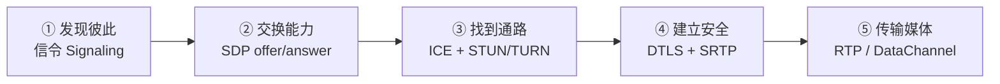
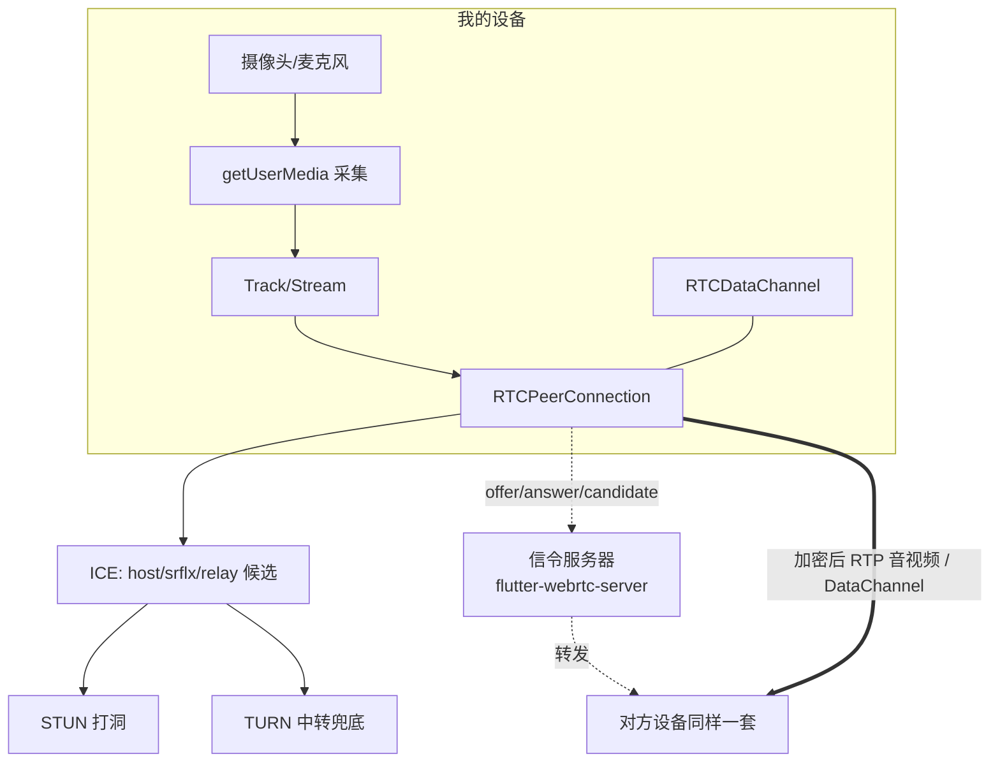

# 01 WebRTC 基础概念

> 状态：🟢 已填充 ｜ 读者：WebRTC 小白 ｜ 难度：★☆☆☆☆
> 目的：建立一张"全局地图"，知道 WebRTC 是什么、能干什么、由哪些部件组成、一次连接要走完哪几步。

---

## 1.1 一句话理解

**WebRTC（Web Real-Time Communication，网页实时通信）是一套让两个终端「不经过服务器转码、直接点对点」传输音视频和任意数据的开放技术。**

关键在三个字：**点对点（P2P）**。视频字节流不经过业务服务器，而是从一端直接流向另一端。

> 生活比喻：打电话时，**电话号码簿/接线员**帮你找到对方并接通（= 信令服务器），但接通后**你们两人直接说话**（= P2P 媒体），接线员不再插嘴。

所以从第一天就要记住一个"反常识"：

```
WebRTC ≠ 服务器帮你转发视频
WebRTC = 服务器帮你"找到对方 + 交换钥匙"，视频由双方直连
```

**对应本项目**：Rephone Security 的信令服务器（`flutter-webrtc-server`）只做"找人与传小纸条"（`offer/answer/candidate`），相机端和监控端之间的画面是 P2P 直连的；只有当两边网络都打洞失败时，才退而求其次经过 TURN 服务器中转。

## 1.2 为什么要用 WebRTC（适用场景）

| 场景 | 说明 | 本项目例子 |
| --- | --- | --- |
| 实时音视频通话 | 低延迟(<几百 ms)，无需服务器转码成本 | 相机端 ↔ 监控端 实时画面 + 对讲 |
| 1 对 1 / 1 对 N 低规模直播 | 规模小可直接 Mesh（每端两两互联） | 一个相机同时被一个监控端看 |
| 实时数据通道 | 延迟敏感的小数据 / 大文件分块直传 | 事件列表 JSON、录像二进制回传（DataChannel） |
| 云监控/远程查看 | 相机常驻采集，用户随时拉流 | Rephone Security 的核心场景 |

**相对传统方案的优点**：不占用服务器带宽（P2P）、延迟低、端上加密（DTLS-SRTP）、免费（不依赖第三方 CDN/流媒体服务器）。

**代价/边界**（也要知道，才不会想当然）：
1. 必须**先通过某种信令**让双方互相认识（WebRTC 自己不管这件事）。
2. 端上编码解码，**对设备性能有要求**。
3. 大规模（几百上千同时看）不适合纯 P2P，需要 SFU/MCU 媒体服务器。
4. 端与端之间的网络可能不通（详见 1.6 的 NAT/TURN）。

## 1.3 WebRTC 的四大件（核心 API）

对新手，整个 WebRTC 可以拆成 4 个"积木"：

| 积木 | 干什么 | 浏览器 API | flutter_webrtc 中的名字 | 本项目所在代码 |
| --- | --- | --- | --- | --- |
| ① 采集 | 拿摄像头/麦克风/屏幕 | `getUserMedia` / `getDisplayMedia` | `navigator.mediaDevices.getUserMedia()` | `signaling.dart` 的 `createStream()`、`setMonitorTalkbackEnabled()`（对讲麦克风） |
| ② 传输 | 点对点收发音视频（黑盒，最重要） | `RTCPeerConnection` | `createPeerConnection()` | `signaling.dart` 的 `_createSession()` |
| ③ 数据 | 点对点传输任意数据（文本/二进制） | `RTCDataChannel` | `pc.createDataChannel()` | `signaling.dart` 的 `_createDataChannel()`（label=`fileTransfer`） |
| ④ 事件 | 上面三者的各种状态回调 | `onicecandidate/ontrack/...` | `pc.onIceCandidate`、`pc.onTrack` | `signaling.dart` 全程使用 |

**记忆口诀**：**采（采集）—传（传输）—数（数据）—感（感知回调）**。

### ① 采集 getUserMedia

把摄像头/麦克风变成一条条 **Track（轨道）**，装进一个 **Stream（流）**。

```12:28:rephone-security/lib/services/signaling.dart
// 本项目：相机端拉起 640x480、30fps、指定前后摄
final mediaConstraints = {
  'audio': true,
  'video': {
    'mandatory': {'minWidth': '640', 'minHeight': '480', 'minFrameRate': '30'},
    'facingMode': _currentFacingMode, // 'user'(前摄) / 'environment'(后摄)
  },
};
stream = await navigator.mediaDevices.getUserMedia(mediaConstraints);
```

注意区分两个词（后面术语表也会列）：
- **Track** = 一条独立轨道（一路摄像头画面 / 一路麦克风声音）。
- **Stream** = Track 的容器，可含多路音频 + 多路视频。

### ② 传输 RTCPeerConnection（PC）

PC 是**最核心也最复杂的黑盒**。你只管"往里塞本地轨道、往外听远端轨道"，至于底层怎么做 NAT 穿越、怎么协商加密、怎么抗丢包——都是它内部完成。

```641:670:rephone-security/lib/services/signaling.dart
// 本项目：创建 PC（传入 ICE 服务器 + sdpSemantics）
RTCPeerConnection pc = await createPeerConnection({
  ..._iceServers,
  ...{'sdpSemantics': 'unified-plan'}
}, _config);

// 本地轨道塞进 PC（相机端）
_localStream!.getTracks().forEach((track) async {
  _senders.add(await pc.addTrack(track, _localStream!));
});

// 远端来了轨道就回调（监控端收画面）
pc.onTrack = (event) { ... onAddRemoteStream / onAddRemoteAudioStream ... };
```

### ③ 数据通道 RTCDataChannel

在 PC 之上再开一条"快递通道"，可以传文本/二进制，延迟低。本项目用 `label='fileTransfer'` 的 DC 传输事件控制消息和录像文件。

```765:773:rephone-security/lib/services/signaling.dart
// 本项目：主叫方在 PC 上创建数据通道
RTCDataChannel channel =
    await session.pc!.createDataChannel('fileTransfer', dataChannelDict);
```

### ④ 回调（事件）

所有"发生了什么"都靠回调告诉你，例如：`onIceCandidate`（找到了候选地址）、`onTrack`（远端流到达）、`onIceConnectionState`（连接状态变化）、`onDataChannel`（对方请求开通道）。

## 1.4 一次连接的五大阶段（宏观模型）

这是整本手册的"主线剧情"，务必先记住框架，细节在后续章节展开：



| 阶段 | 一句话 | 通俗解释 | 关键技术 | 本项目位置 |
| --- | --- | --- | --- | --- |
| ① 发现彼此 | 双方通过"中间人"互相拿到 ID | 接线员把 A 的电话给 B | WebSocket 信令 | `websocket.dart` + `signaler.go` |
| ② 交换能力 | 告诉对方"我能收/发什么格式" | 互递"能力清单" | SDP（offer/answer） | `signaling.dart` `_createOffer/_createAnswer` |
| ③ 找到通路 | 在各种网络路径里找出能用的那条 | 在迷宫试路 | ICE/STUN/TURN | `turn.dart`、`pc.onIceCandidate` |
| ④ 建立安全 | 加密握手，保证只有彼此能听懂 | 先对暗号再说话 | DTLS、SRTP 加密 | PC 内部自动完成 |
| ⑤ 传输媒体 | 音视频字节流与数据点对点流动 | 正式通话 | RTP / DataChannel | `pc.onTrack`、DC 收发 |

> 关键认知：**①② 必须借助服务器（信令），③④⑤ 都不需要服务器持续参与**（④的握手细节需要 candidate 通路交换指纹，⑤ 完全 P2P）。
> 这也是为什么文档名叫"信令连通逻辑"——服务器只负责 ①②，真正干活的是 ③④⑤。

## 1.5 角色：主叫 Offerer 与被叫 Answerer

- 发起呼叫的一方叫 **Offerer（主叫）**，负责生成 **offer**（我第一次的能力清单）。
- 接受呼叫的一方叫 **Answerer（被叫）**，回复 **answer**（我的能力清单）。
- **角色不对称**：offer 必须携带媒体方向（我要发什么、想收什么），answer 只需回应。

**对应本项目**：
- 监控端 = Offerer：`invite(cameraId, 'video')` → `createOffer()`。
- 相机端 = Answerer：收到 offer → 校验后 `accept()` → `createAnswer()`。

> 反直觉点：本项目里"相机"看似是视频的**提供方**，但呼叫关系上**监控端是主叫**。谁点"呼叫"谁是 Offerer，和"谁出画面"无关。

## 1.6 网络穿越：为什么不能直接连？（NAT / STUN / TURN / ICE）

这是新手最容易懵、但又是 WebRTC 精髓的地方。

### 背景问题：NAT

大部分设备在路由器（NAT）后面，只有一个**内网 IP**（如 `192.168.1.5`），外面根本找不到它。想 P2P，得先知道它在公网上的"临时地址"。

### 三个工具

| 工具 | 全称 | 干什么 | 生活比喻 |
| --- | --- | --- | --- |
| STUN | Session Traversal Utilities for NAT | 帮你问"我的公网地址是什么"（只问不转） | 照镜子 / 问路人你地址牌上写啥 |
| TURN | Traversal Using Relays around NAT | 打洞失败时，帮你**中转**媒体 | 找不到路时走"代收代发"快递 |
| ICE | Interactive Connectivity Establishment | **决策者**：收集所有候选，两两试通，挑最快能用的 | 同时试多条路，哪条先通走哪条 |

> 一句话串联：**ICE 先试直连 → 不行就试 STUN 打洞出的"公网映射地址" → 都不行就用 TURN 中转**。

### ICE Candidate（候选）

每个"可能通路的地址"就是一个 candidate，例如：
- `host`：本机内网地址 `192.168.1.5:54123`
- `srflx`：STUN 反射出的公网地址 `1.2.3.4:51234`
- `relay`：TURN 中转地址

两端把各自的候选通过信令互发（这消息就叫 `candidate`），然后互相"试连"。**候选是陆续产生的，边发现边发——这就是 trickle ICE**。

**对应本项目**（配置在 `signaling.dart` 顶部 + `turn.dart`）：

```117:129:rephone-security/lib/services/signaling.dart
// 兜底方案：纯 STUN（连不上时也能打洞，但穿不过对称 NAT）
Map<String, dynamic> _iceServers = {
  'iceServers': [
    {'url': 'stun:stun.l.google.com:19302'},
  ]
};
```

```499:517:rephone-security/lib/services/signaling.dart
// 连接前先向自家服务器要"24小时有效的 TURN 凭据"，成功后只用 TURN
_turnCredential = await getTurnCredential(_host, _port);
_iceServers = { 'iceServers': [ { 'urls': ...turn... } ] };
```

服务端 `HandleTurnServerCredentials`（`signaler.go`）用 HMAC-SHA1 签发短期凭据，并把它缓存进 `expresMap`，供之后 TURN 握手时校验（`authHandler`）。

## 1.7 新手必避的三个"概念坑"

1. **WebSocket ≠ WebRTC**
   WebSocket 是"服务器↔客户端"的长连接，用于传信令小纸条；WebRTC 是"端↔端"的媒体传输。本项目两条腿：WS 走信令（`/ws`），WebRTC 走媒体（UDP/RTP）。**信令服务器倒了只是"找不到对方"，已建立的通话不会立刻断**（但重协商/新呼叫会失败）。
2. **信令服务器 ≠ 媒体服务器（SFU/MCU）**
   - 本项目服务端只是**信令转发**（relay 小纸条），视频不经过它 → 带宽成本 ≈ 0。
   - 若做多方会议/万人直播，才需要 SFU（选择性转发）或 MCU（混合）媒体服务器。Rephone Security 是 1 相机 ↔ 1 监控的 P2P（Mesh），不需要。
3. **"连上了"不代表"有画面"**
   `CallStateConnected`（信令层面 SDP 交换完）≠ ICE 通路已通 ≠ 第一帧已出。监控端常见：状态 Connected 但黑屏 → 大概率卡在 ③ ICE 或 ⑤ 首帧/解码。排查顺序见 `07-问题与坑位记录.md`。

## 1.8 一张"心智地图"复习本章



## 1.9 下一步

- 记不清名词 → 翻 `02-WebRTC-术语速查表.md`
- 想知道这套概念在本项目代码里长什么样 → 跳到 `06-项目代码地图.md`
- 想深入信令报文怎么传 → `04-信令与连接建立.md`（配套完整时序见 `docs/监控端WebRTC信令连通逻辑.md`）
