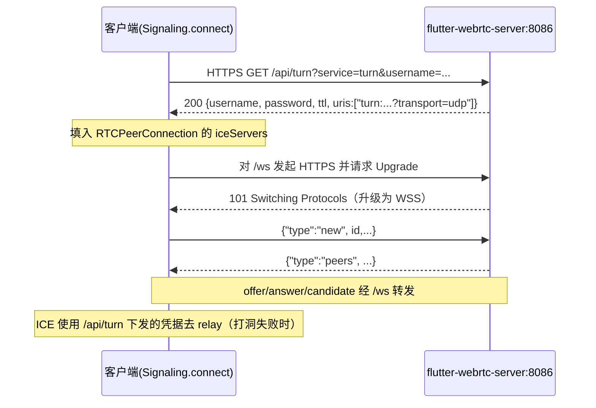
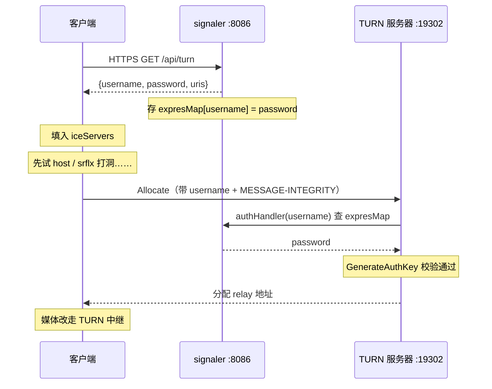
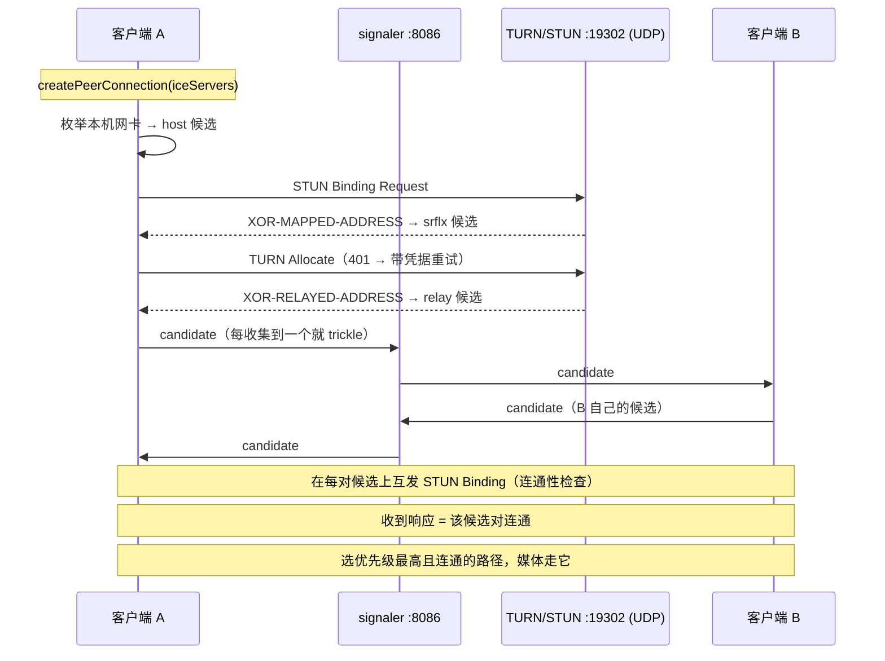

# 04 信令与连接建立

> 状态：🟡 骨架 + 4.0 / 4.3 已填充 ｜ 难度：★★☆☆☆
> 本章要解决的问题：**两个设备怎么通过服务器互相找到、交换能力清单、最终打通 P2P？**

---

## 与现成资料的关系（先读这份，再回来加深）

⚠️ **结论先行版**（本项目连通全链路、含完整时序图）已有一份深度文档：

> 📄 `../监控端WebRTC信令连通逻辑.md`（即 `docs/监控端WebRTC信令连通逻辑.md`）

本章作为其**"为什么这么设计"的概念深化篇**：把每一步背后的 WebRTC 原理讲透，把连接建立过程拆成通用知识（不只适用于本项目）。

---

## 4.0 先修：HTTPS vs WSS、本项目两个端点、以及 TURN 到底干什么

> 状态：🟢 已填充
> 对应代码：`flutter-webrtc-server/pkg/websocket/server.go`、`flutter-webrtc-server/pkg/signaler/signaler.go`；客户端 `rephone-security/lib/services/{signaling,websocket,turn}.dart`

新手第一次看到本项目这两个地址时，几乎都会卡在同一个问题：

```text
wss://rephone.top:8086/ws          ← 信令
https://rephone.top:8086/api/turn  ← TURN 凭据
```

一个 `wss://`、一个 `https://`，端口还一样（都是 `8086`），到底什么关系？下面先拆「HTTPS vs WSS」，再拆「这两个地址在 WebRTC 里的分工」。

### 4.0.1 HTTPS 与 WSS 的区别：同一层加密，不同层协议

一句话结论：

> **WSS = WebSocket over TLS，HTTPS = HTTP over TLS。两者共用同一个 TLS 加密底座，区别只在 TLS 之上的「应用层协议」是 WebSocket 还是 HTTP。**

用生活化比喻：

- **TLS（俗称 SSL）** = 一条加密隧道，负责「别人偷看不到、也改不了」。
- **HTTP** = 隧道里跑的「一问一答快递」：客户端提一个请求，服务器回一个响应，然后连接可以关掉。
- **WebSocket** = 隧道里跑的「双向对讲专线」：握手一次后，双方随时都能主动说话，连接一直挂着。

| 对比项 | HTTPS (`https://`) | WSS (`wss://`) |
| --- | --- | --- |
| 全称 | HTTP over TLS | WebSocket over TLS |
| 加密层 | TLS（相同） | TLS（相同） |
| 应用层协议 | HTTP：请求-响应 | WebSocket：全双工长连接 |
| 通信方向 | 基本是「客户端问、服务器答」 | 双方都可以随时主动推消息 |
| 连接寿命 | 通常一次请求/响应就结束 | 建立后长期保持 |
| 握手方式 | TLS 握手 | TLS 握手 + HTTP `Upgrade: websocket` 升级 |
| 典型用途 | 拉一次数据（如取 TURN 凭据、查列表） | 需要服务器主动推送（如信令转发、在线状态） |
| 明文对应物 | `http://` | `ws://` |

> 记忆口诀：**`s` 代表 TLS（加密），前面的 `http` / `ws` 才是「说话方式」。** 所以 `wss://` 和 `https://` 不是「两种安全等级」，而是「同一种安全，两种说话方式」。

#### 一个小坑：代码里写的是 `https://.../ws`，为什么说它是 `wss://`？

看客户端 `rephone-security/lib/services/signaling.dart`（约 493 行）：

```dart
var url = 'https://$_host:$_port/ws';
_socket = SimpleWebSocket(url);
```

再看 `services/websocket.dart` 的 `_connectForSelfSignedCert()`：它**没有**直接用 `WebSocket.connect`，而是自己用 `HttpClient` 发了一个 HTTPS 请求，手动加上：

```dart
request.headers.add('Connection', 'Upgrade');
request.headers.add('Upgrade', 'websocket');
request.headers.add('Sec-WebSocket-Version', '13');
request.headers.add('Sec-WebSocket-Key', key);
```

拿到 `101 Switching Protocols` 后，再用 `WebSocket.fromUpgradedSocket()` 把这条连接「升级」成 WebSocket。

也就是说：**`wss://host/ws` 在协议层等价于「先用 HTTPS 连到 `/ws`，再通过 HTTP Upgrade 升级成 WebSocket」**。本项目为了放行自签证书（`badCertificateCallback = true`）走了手动升级这条路，所以 URL 写成了 `https://`；但语义上它就是 `wss://`。服务端 `pkg/websocket/server.go` 的 `handleWebSocketRequest()` 用 `upgrader.Upgrade()` 完成另一半升级，并由 `http.ListenAndServeTLS()`（即 HTTPS）统一对外提供服务。

### 4.0.2 两个端点在 WebRTC 里的分工

| 地址 | 协议 / 角色 | 干什么 | 何时被调用 | 代码位置 |
| --- | --- | --- | --- | --- |
| `wss://rephone.top:8086/ws` | WebSocket：**信令通道** | 设备注册(`new`)、广播在线名册(`peers`)、转发 `offer/answer/candidate/bye`、心跳 `keepalive` | 建连全程（从建连前到会话结束） | 客户端 `signaling.dart` `connect()`；服务端 `signaler.go` `HandleNewWebSocket()` |
| `https://rephone.top:8086/api/turn` | HTTP：**TURN 凭据签发接口** | 动态签发一组有时效的 TURN 用户名/密码（HMAC-SHA1 计算），供 `RTCPeerConnection` 打洞失败时中继媒体 | 每次 `connect()` 时拉一次（本项目缓存到 `_turnCredential`） | 客户端 `turn.dart` `getTurnCredential()`；服务端 `signaler.go` `HandleTurnServerCredentials()` |

**为什么一个必须用 WSS、另一个用 HTTPS 就够了？**

- 信令是「服务器随时要主动推给你」的场景：相机上线要广播、有人呼叫你要转发 offer……如果只有 HTTPS，客户端得不停轮询，既慢又费。所以信令用**长连接 WSS**。
- 取 TURN 凭据是「问一次拿一次」的场景：拿到 JSON 就完事，不需要长连接，所以用**普通 HTTPS 请求**即可。

**两者如何协作（一次连接建立里的先后顺序）：**



关键点：

1. **`/api/turn` 不参与信令**，它只负责「发钥匙」：客户端拿到 `username/password/uris` 后，塞进 `RTCPeerConnection` 的 `iceServers`（见 `signaling.dart` 约 509–517 行）。
2. **`/ws` 不碰媒体**，它只转发「小纸条」（SDP、ICE 候选）。媒体最终走 ICE 选出的通路；只有直连打不通时，才由 TURN 服务器中继——这正是 `/api/turn` 下发的凭据在起作用。
3. 端口相同（`8086`）只是**同一台服务器复用同一个 TLS 监听**：Go 的 `http.ListenAndServeTLS` 同时承载 `/ws`（升级为 WebSocket）和 `/api/turn`（普通 HTTP）。URL 里 scheme 不同，物理上是同一个 HTTPS 服务。

> 一句话总结：**`/api/turn` 负责「发中继钥匙」（HTTPS，拉一次）；`/ws` 负责「传信令小纸条」（WSS，长连接）。**

### 4.0.3 深挖：TURN 到底干什么？（打不通时的中继兜底）

> 状态：🟢 已填充
> 对应代码：`flutter-webrtc-server/pkg/signaler/signaler.go`、`pkg/turn/turn.go`、`configs/config.ini`；客户端 `rephone-security/lib/services/{turn,signaling}.dart`

**一句话：TURN 是 P2P 打洞失败时的「媒体中继服务器」。**

WebRTC 的理想是两设备**直连（P2P）**，媒体包不经过任何服务器。但现实中设备大多在 NAT/防火墙后面，直连经常失败。这时 TURN 就充当**中转站**：媒体走 `A → TURN → B`，牺牲带宽与延迟，换取「一定能通」。

#### 为什么需要它：NAT 是头号障碍

- 内网设备没有公网地址，外面连不进来。
- **锥形 NAT** 下，STUN 帮双方探到各自的公网映射地址，可以直接打洞（免费）。
- **对称 NAT / 严格企业防火墙**下，打洞失败，只能找一台有公网地址的服务器帮忙转发——这就是 TURN。

#### ICE 的三类候选：relay 是兜底

| 候选类型 | 来源 | 何时能用 | 代价 |
| --- | --- | --- | --- |
| `host` | 本机网卡地址 | 同一局域网 | 免费 |
| `srflx`（STUN） | 通过 STUN 探测到的公网映射地址 | 锥形 NAT，可打洞 | 免费 |
| `relay`（TURN） | TURN 服务器分配的中继地址 | 打洞失败时的**唯一选择** | 媒体过服务器，费带宽、增延迟 |

ICE 按优先级尝试：先 host/srflx，都失败才退化到 relay。所以 **TURN 是「兜底」而非「默认」**。

#### 为什么 TURN 需要「凭据」：防止被白嫖

TURN 是一台公网中继，谁都能连。若不加限制，任何人都能拿它转发流量（盗用带宽、甚至被当代理滥用）。因此业界用 **TURN REST API**（RFC 草案 `draft-uberti-behave-turn-rest`，即 `signaler.go` 注释里的那条链接）签发**短时效凭据**：客户端必须先从应用服务器换取用户名/密码，再拿它去 TURN 服务器开中继。

#### 本项目的完整闭环（签发 → 使用 → 校验）

**第一步：服务端签发（`signaler.go` → `HandleTurnServerCredentials`）**

- 拼用户名：`turnUsername = "时间戳:用户名"`（时间戳让凭据可校验时效、不可长期复用）。
- 算密码：`password = base64(HMAC-SHA1(sharedKey, username))`，`sharedKey` 仅服务端知道。
- 存起来：写进 `expresMap`（TTL 24h），供后续校验。
- 返回：`{username, password, ttl, uris}`。

本项目 `config.ini` 配置 `public_ip=47.251.242.213`、`port=19302`、`realm=flutter-webrtc`，所以下发的 `uris` 实际为 `turn:47.251.242.213:19302?transport=udp`。

**第二步：客户端使用（`signaling.dart` 约 509–517 行）**

拿到 JSON 后填进 `RTCPeerConnection` 的 `iceServers`：

```dart
_iceServers = {
  'iceServers': [
    {
      'urls': _turnCredential['uris'][0],
      'username': _turnCredential['username'],
      'credential': _turnCredential['password']
    },
  ]
};
```

随后 `createPeerConnection` 用它建 PC；ICE 收集候选时就会向 TURN 服务器申请中继地址。

**第三步：TURN 服务器校验（`turn.go` + `signaler.go`）**

打洞失败时，客户端向 TURN 服务器（19302）发 `Allocate`，带上 username 和用 password 算出的 `MESSAGE-INTEGRITY`。pion 调 `HandleAuthenticate` → `signaler.authHandler()` 用 username 查 `expresMap` 拿回 password → `turn.GenerateAuthKey(username, realm, password)` 校验。**校验通过才分配 relay 地址**，媒体从此改走中继。



#### 几个容易踩的点

- **`/api/turn` 只发钥匙，不转发媒体**；真正转发媒体的是 `config.ini` 里 `port=19302` 那个 UDP 监听，两者是不同端口。
- **本项目实际只用 TURN 作为 ICE server**：`signaling.dart` 约 509 行是**重新赋值** `_iceServers`（不是追加），取到凭据后最初那个 `stun:stun.l.google.com` 被覆盖。这没问题——pion 的 TURN 服务器同时应答 STUN Binding 请求，`srflx` 候选仍能从它这里拿到。
- **凭据有时效**：`ttl=86400`（24 小时），`expresMap` 到期即失效，所以不能把用户名密码硬编码进客户端。
- **代价**：一旦走 relay，所有音视频包都过服务器，带宽与延迟显著上升。

> 一句话总结：**TURN = 打洞失败时的媒体中转站；`/api/turn` 发一把 24 小时有效的临时钥匙，客户端拿它去 TURN 服务器（19302）开一条中继通道，让音视频绕道传输。**

---

## 章节内容（4.1 / 4.2 / 4.4–4.6 待填充）

### 4.1 为什么 WebRTC 需要"外部信令"（先立观念）
- [ ] 规范把"如何找到对端"留给开发者 → 各家自选 WebSocket/HTTP/邮件
- [ ] 信令只该传三类消息：会话控制(呼叫/挂断) + 媒体协商(SDP) + 网络协商(ICE 候选)
- [ ] 对照本项目 9 类消息：`new/peers/offer/answer/candidate/bye/leave/keepalive/error`

### 4.2 Offer/Answer 模型（RFC 3264）
- [ ] JSEP：JS 会话建立协议（为什么 SDP 协商放浏览器里做）
- [ ] 主叫生成 offer（含媒体方向），被叫回 answer
- [ ] "会话内改媒体"= renegotiation（本项目对讲加麦克风即触发，复用 PC）
- [ ] 竞赛条件 glare：双方同时发 offer 怎么办（TODO：查 RFC 处理）

### 4.3 ICE 与候选交换（连接建立的核心难点）

> 状态：🟢 已填充
> 对应代码：客户端 `rephone-security/lib/services/signaling.dart`（`_iceServers` 117–129 / 509–517 行、`createPeerConnection` 641–644 行、`onIceCandidate` 717–737 行、`remoteCandidates` 缓冲 393–398 / 414–419 行）；服务端 `flutter-webrtc-server/pkg/turn/turn.go`、`pkg/signaler/signaler.go`、`configs/config.ini` `[turn]`

**一句话：候选地址不是配置里「给」的，而是 ICE agent 现场「收集」出来的——host 来自本机网卡，srflx 来自 STUN 探测，relay 来自 TURN 分配。**

#### 4.3.1 先破除误解：`iceServers` 是「服务器清单」，不是「候选清单」

很多人第一次看这段代码，会以为 `_iceServers` 里装的就是地址候选：

```dart
RTCPeerConnection pc = await createPeerConnection({
  ..._iceServers,
  ...{'sdpSemantics': sdpSemantics}
}, _config);
```

其实它是 `RTCConfiguration`，只告诉 PC「打洞/中继可以找哪几台服务器帮忙」。真正的候选地址由 PC 内部的 ICE agent 在运行中产生。两者关系：

| | `iceServers`（配置） | ICE 候选（运行时产物） |
| --- | --- | --- |
| 内容 | 服务器 URI + 凭据 | `host` / `srflx` / `relay` 三类地址 |
| 谁给的 | 开发者（本项目来自 `/api/turn`） | ICE agent 收集产生 |
| 数量 | 通常 1–3 条 | 可能十几条（每种网卡 × 每种类型各若干） |

#### 4.3.2 候选三兄弟的产生条件

| 候选类型 | 从哪来 | 依赖 `iceServers` | 需要鉴权 | 优先级 |
| --- | --- | --- | --- | --- |
| `host` | **本机网卡枚举**（Wi-Fi / 蜂窝 / 以太网 IP + 随机端口） | ❌ 纯本地 | 否 | 最高 |
| `srflx` | 向 STUN 服务器发 Binding 请求，读回公网映射地址 | ✅ 需 `stun:`（或 TURN，见下） | 否 | 中 |
| `relay` | 向 TURN 服务器发 Allocate，它分配一个中继地址 | ✅ 只有 `turn:` 才有 | ✅ 是 | 最低 |

候选字符串长这样（第 3 个数字是优先级，`typ` 是类型）：

```text
candidate:1 1 udp 2130706431 192.168.1.10   54321 typ host
candidate:2 1 udp 1694498815 203.0.113.7    54322 typ srflx raddr 192.168.1.10 rport 54321
candidate:3 1 udp 16777215   47.251.242.213 49152 typ relay raddr 0.0.0.0      rport 0
```

> ⚠️ 注意区分：`srflx` 里的地址是**客户端自己的公网映射地址**（示例中的 `203.0.113.7`），**不是**服务器地址；`relay` 里的地址才是**服务器分配的**（`47.251.242.213:49152`）。

**为什么本项目只配了 TURN，三种候选却依然齐全？** 两个原因：

1. `host` 候选跟 `iceServers` 无关，枚举本机网卡就有；
2. **TURN 协议本身就是 STUN 的扩展，TURN 服务器必须同时应答 STUN Binding 请求**——所以只配 `turn:` 等于同时配了 STUN + TURN，`srflx` 照样能从它这里拿到，只是额外多出了 `relay`。

> 顺带一个隐藏行为：`connect()` 里取 TURN 凭据的 `catch` 是**空的**（`signaling.dart` 518 行）。若 `/api/turn` 请求失败，`_iceServers` 不会被覆盖，会保持初始的 `stun:stun.l.google.com:19302`——即「正常走 TURN 兜底，取凭据失败则退回纯 STUN」的隐式降级。

#### 4.3.3 `turn:47.251.242.213:19302` 到底是谁在和谁通信？

这条 URI 描述的是「**客户端 ↔ TURN/STUN 服务器**」的通信，三个关键事实：

1. **发起方不是 Dart 代码**，而是 flutter-webrtc 的原生层（libwebrtc 的 ICE agent / `BasicPortAllocator`）。Dart 侧只做了「把 `iceServers` 传给 `createPeerConnection`」这一件事，之后完全不参与。
2. **传输层是裸 UDP**，不是 WebSocket/HTTPS——URI 里的 `?transport=udp` 就是这个意思。它**不走 8086**，也**不经过 `/ws` 或 `/api/turn`**。
3. **对端是 TURN 服务器**，与 8086 的 HTTPS 服务是**两个独立监听**：同一台机器，但一个是 `http.ListenAndServeTLS`（8086/TCP），一个是 `net.ListenPacket("udp4", "0.0.0.0:19302")`（19302/UDP，见 `turn.go` 47 行）。

三条通道的分工：

| 通道 | 协议 / 端口 | 谁在用 | 传什么 |
| --- | --- | --- | --- |
| `/api/turn` | HTTPS 8086/TCP | Dart（`turn.dart`） | 取 TURN 用户名/密码（钥匙） |
| `/ws` | WSS 8086/TCP | Dart（`signaling.dart`） | SDP、ICE 候选等信令（小纸条） |
| `turn:...:19302` | STUN/TURN over UDP 19302 | **原生层 libwebrtc** | 探测公网地址、申请中继、中继媒体 |

#### 4.3.4 STUN 探测：怎么问出「我的公网地址」

STUN 报文（RFC 5389）是二进制格式，固定 20 字节头：

```text
 0                   1                   2                   3
 0 1 2 3 4 5 6 7 8 9 0 1 2 3 4 5 6 7 8 9 0 1 2 3 4 5 6 7 8 9 0 1
+-+-+-+-+-+-+-+-+-+-+-+-+-+-+-+-+-+-+-+-+-+-+-+-+-+-+-+-+-+-+-+-+
|0 0|     Message Type          |        Message Length         |
+-+-+-+-+-+-+-+-+-+-+-+-+-+-+-+-+-+-+-+-+-+-+-+-+-+-+-+-+-+-+-+-+
|                    Magic Cookie (0x2112A442)                  |
+-+-+-+-+-+-+-+-+-+-+-+-+-+-+-+-+-+-+-+-+-+-+-+-+-+-+-+-+-+-+-+-+
|                     Transaction ID (96 bits)                  |
+-+-+-+-+-+-+-+-+-+-+-+-+-+-+-+-+-+-+-+-+-+-+-+-+-+-+-+-+-+-+-+-+
```

- `Message Type`：Binding Request = `0x0001`，Binding Success Response = `0x0101`。
- `Magic Cookie`：固定 `0x2112A442`，用来识别「这是 STUN 报文」。
- `Transaction ID`：96 bit 随机数，用于把请求和响应配对。

一次 srflx 探测只有两步：

1. 客户端从某个本地 UDP 端口（比如 `54321`）向 `47.251.242.213:19302` 发一个 **Binding Request**。
2. 服务器不解析内容，只把「它看到的来源地址」（即 NAT 之后的公网映射地址）写进 **`XOR-MAPPED-ADDRESS`** 属性，回一个 Binding Success Response。
3. 客户端解析出来 → 生成一条 `typ srflx` 候选。

> **为什么地址要 XOR 而不直接明文写？** 老式 NAT 的 ALG 会「自作聪明」改写载荷里的 IP 字段，导致地址被改坏。把地址与 Magic Cookie 异或后再塞进属性，ALG 认不出来就不会动它，从而保证拿到的映射地址是真实的。

#### 4.3.5 TURN Allocate：怎么申请一个中继地址（含鉴权）

`relay` 候选比 `srflx` 多一步「申请 + 鉴权」：

1. 客户端向 19302 发 **Allocate Request**（`Message Type = 0x0003`），带 `REQUESTED-TRANSPORT = 17`（UDP 的 IANA 协议号）。
2. 服务器发现没带鉴权信息 → 回 **`401 Unauthorized`**，并附上 `REALM="flutter-webrtc"` 和一次性的 `NONCE`。
3. 客户端用 `/api/turn` 拿到的 username/password 计算：
   - `key = MD5(username ":" realm ":" password)`
   - `MESSAGE-INTEGRITY = HMAC-SHA1(key, 报文内容)`
   然后带 `USERNAME / REALM / NONCE / MESSAGE-INTEGRITY` **重发** Allocate。
4. 服务器校验：pion 调 `HandleAuthenticate`（`turn.go` 73 行）→ `signaler.authHandler()`（`signaler.go` 128 行）用 username 查 `expresMap` 取回 password → `turn.GenerateAuthKey(username, realm, password)` 算出同一个 key → 校验 HMAC。**校验通过才分配。**
5. 服务器回 **Allocate Success Response**（`0x0103`），带：
   - **`XOR-RELAYED-ADDRESS`**：分配给你的中继地址（公网 IP + **一个随机端口**）
   - `XOR-MAPPED-ADDRESS`：顺带告诉你公网映射地址（所以一次 Allocate 也顺便给了 srflx 信息）
   - `LIFETIME`：中继有效期（默认 600 秒），到期前客户端要 Refresh
6. 客户端生成一条 `typ relay` 候选。

> **关键细节：19302 只是控制通道。** `turn.go` 用 `RelayAddressGeneratorStatic{RelayAddress: public_ip, Address: "0.0.0.0"}`——中继用的 UDP socket 绑在 `0.0.0.0` 的**随机端口**上，只把 `public_ip` 宣告给客户端。所以真正的媒体中继走的是另一个端口，不是 19302。

`relay` 候选要真正转发媒体，还差两步（都在 TURN 协议内，对开发者透明）：

- `CreatePermission`：授权某个对端 IP 的数据可以进来（防滥用）。
- `ChannelBind`（或 `Send/Data Indication`）：建立通道，媒体以 `ChannelData` 报文高效转发。

#### 4.3.6 完整 ICE 流程：收集 → 交换 → 检查 → 选路



四步与代码的对应关系：

| 阶段 | 做什么 | 本项目代码 |
| --- | --- | --- |
| 收集 | 产生 host/srflx/relay 候选 | 原生层自动完成 |
| 交换 | 逐个经信令发给对端 | `onIceCandidate` → `_send('candidate', ...)` |
| 检查 | 候选对上互发 STUN Binding | 原生层自动完成 |
| 选路 | 选优先级最高且连通的候选对 | 原生层自动完成 |

#### 4.3.7 trickle ICE 与候选乱序

传统 ICE 要等候选**全部收集完**（可能好几秒）才把完整 SDP 发出去，建连很慢。**trickle ICE** 改成「每收集到一个就立刻发」，不用等——本项目的 `onIceCandidate` 就是这么做的。

代价是**乱序**：候选可能比 offer/answer 先到，此时对端可能还没有 `pc`、或还没 `setRemoteDescription`，直接 `addCandidate` 会失败。本项目用 `Session.remoteCandidates` 做缓冲：

- 收到候选时若 `pc == null`（或还没设远端描述）→ 先存进 `remoteCandidates`；
- `setRemoteDescription` 完成后，把缓冲的候选逐个 `addCandidate` 再清空（`signaling.dart` 393–398、414–419 行）。

#### 4.3.8 为什么 `onIceCandidate` 发送前 sleep 1 秒

代码注释自己给了答案：

> This delay is needed to allow enough time to try an ICE candidate before skipping to the next one. 1 second is just an heuristic value and should be thoroughly tested in your own environment.

可以理解为一种**粗暴的候选发送节流**：把「瞬间 trickle」变成「每 1 秒放一个」。

- 好处：避免一次性把十几条候选砸给对端，造成信令拥塞或乱序加剧。
- 坏处：候选多时建连明显变慢（N 条 ≈ N 秒）；注释本身也承认这只是 heuristic，需要按实际网络调优。

> 一句话总结：**候选是 ICE agent「收集」出来的（host 来自本机网卡、srflx 来自 STUN 探测、relay 来自 TURN 分配）；`turn:...:19302` 是原生层 libwebrtc 用裸 UDP 直连 TURN/STUN 服务器的通道，和 8086 上的 `/ws`、`/api/turn` 完全是两回事。**

### 4.4 DTLS 与 SRTP（先占位，03 章之外的安全面）
- [ ] 为什么必须先握手再传媒体（防中间人/窃听）
- [ ] 证书指纹如何在 SDP 中交换（`a=fingerprint`）

### 4.5 本项目信令转发实现剖析（服务端视角）
- [ ] `/ws` 连接与消息循环（`pkg/websocket/server.go` → `signaler.go`）
- [ ] 路由只认 `to/from/session_id`：`Offer/Answer/Candidate` 原样转发
- [ ] `bye` 按 `session_id.split('-')` 双向通知；`new`/断线 → 全量 `peers` 广播
- [ ] 无状态中继设计 vs 房间式服务器（各自的取舍）

### 4.6 一次完整呼叫的报文时间线（验证所学）
- [ ] 用日志/抓包录一段真实报文序列，对照本文各节贴成笔记

## 待填充清单
- [x] 4.0 HTTPS vs WSS 区别、本项目 `/ws` 与 `/api/turn` 分工
- [x] 4.0.3 TURN 到底干什么（打洞失败时的中继兜底、凭据签发/使用/校验闭环）
- [x] 4.3 ICE 与候选交换（候选三兄弟来源、STUN/TURN 探测报文、trickle 与乱序缓冲、sleep 1s 原因）
- [ ] 4.1 信令定位与消息分类
- [ ] 4.2 Offer/Answer/JSEP/glare
- [ ] 4.4 DTLS/SRTP 简介
- [ ] 4.5 服务端实现剖析
- [ ] 4.6 真实报文时间线

## 对应本项目（索引）
- 完整时序文档：`docs/监控端WebRTC信令连通逻辑.md`
- 客户端消息处理：`rephone-security/lib/services/signaling.dart` → `onMessage()`
- 服务端路由/转发：`flutter-webrtc-server/pkg/signaler/signaler.go` → `HandleNewWebSocket()`
- 信令端点（WSS）：`wss://rephone.top:8086/ws`；服务端注册见 `pkg/websocket/server.go` → `Bind()`（`WebSocketPath: "/ws"`）
- TURN 凭据端点（HTTPS）：`https://rephone.top:8086/api/turn`；签发见 `pkg/signaler/signaler.go` → `HandleTurnServerCredentials()`
- 客户端取 TURN 凭据：`rephone-security/lib/services/turn.dart` → `getTurnCredential()`（结果填入 `iceServers`，见 `signaling.dart` 约 509–517 行）
- TURN 中继服务器实现：`flutter-webrtc-server/pkg/turn/turn.go` → `NewTurnServer()` / `HandleAuthenticate()`；监听配置见 `configs/config.ini` `[turn]`（`public_ip=47.251.242.213`、`port=19302`、`realm=flutter-webrtc`）
- TURN 凭据校验回调：`pkg/signaler/signaler.go` → `authHandler()`（用 username 查 `expresMap` 取回 password）
