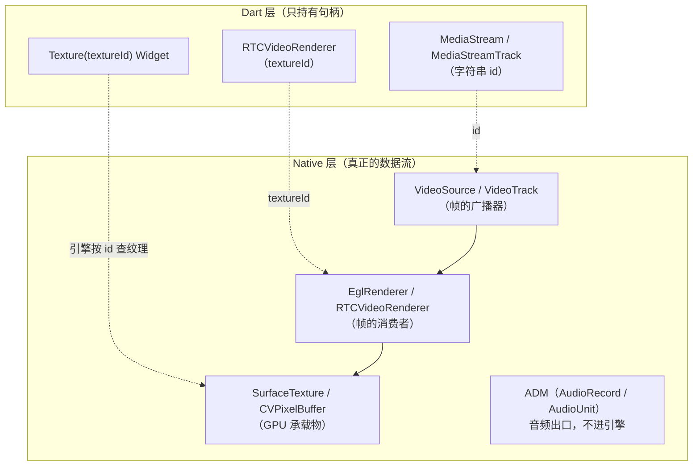

# 08 媒体流与渲染链路（穿透 Native）

> 状态：🟢 已填充 ｜ 读者：想知道"画面到底是怎么从 native 跑到屏幕上"的人
> 目的：把 Dart 层的 `MediaStream` / `textureId` 一路追到平台原生实现，弄清 **stream 在哪创建、纹理怎么绑定、音视频帧怎么被消费、什么时候释放**。

---

## 8.0 路径约定与本图总览

本书中出现的路径简写（行号以本项目当前依赖版本为准）：

| 简写 | 真实路径 |
| --- | --- |
| `flutter_webrtc-1.6.0/` | `~/.pub-cache/hosted/pub.flutter-io.cn/flutter_webrtc-1.6.0/` |
| `rephone-security/` | `business_workspace/rephone-security/` |

**一句话结论**：Dart 层**永远拿不到像素**，它只持有两类句柄——`MediaStreamTrack`（媒体对象句柄）和 `textureId`（显示终端句柄）。所有真正的"流"都在 native 线程里跑。



---

## 8.1 stream 是怎么创建的：getUserMedia 穿透

### 8.1.1 Dart 侧：一层 MethodChannel 转发，不做任何实际工作

```dart
// flutter_webrtc-1.6.0/lib/src/native/mediadevices_impl.dart:30-50
@override
Future<MediaStream> getUserMedia(Map<String, dynamic> mediaConstraints) async {
  final response = await WebRTC.invokeMethod(
    'getUserMedia',
    <String, dynamic>{'constraints': mediaConstraints},
  );
  String streamId = response['streamId'];
  var stream = MediaStreamNative(streamId, 'local');
  stream.setMediaTracks(response['audioTracks'] ?? [], response['videoTracks'] ?? []);
  return stream;
}
```

### 8.1.2 返回的 `MediaStream` 只是"句柄集合"

```dart
// flutter_webrtc-1.6.0/lib/src/native/media_stream_impl.dart:9-33
class MediaStreamNative extends MediaStream {
  final _audioTracks = <MediaStreamTrack>[];
  final _videoTracks = <MediaStreamTrack>[];

  void setMediaTracks(List<dynamic> audioTracks, List<dynamic> videoTracks) {
    for (var track in audioTracks) {
      _audioTracks.add(MediaStreamTrackNative(track['id'], track['label'],
          track['kind'], track['enabled'], ownerTag, track['settings'] ?? {}));
    }
    ... // videoTracks 同理
  }
}
```

`MediaStreamTrackNative` 从平台返回的 Map 里取出 `id/label/kind/enabled/settings`——**全是元数据**。所以 "获取音视频流" = "向平台要一组 id"。

### 8.1.3 Android 侧真正干活的地方

| 步骤 | 代码位置 | 做了什么 |
| --- | --- | --- |
| 视频：建采集器 | `GetUserMediaImpl.java:297-340` | `Camera2Enumerator/Camera1Enumerator.createCapturer(...)` |
| 视频：建 GPU 承载 | `GetUserMediaImpl.java:795-807` | `SurfaceTextureHelper.create("_texture_camera_thread", EglUtils.getRootEglBaseContext())` |
| 视频：接上出口 | `GetUserMediaImpl.java:806-807` | `videoCapturer.initialize(helper, ctx, videoSource.getCapturerObserver())` |
| 视频：开始采集 | `GetUserMediaImpl.java:856` | `videoCapturer.startCapture(targetWidth, targetHeight, targetFps)` |
| 视频：建 track | `GetUserMediaImpl.java:867-868` | `pcFactory.createVideoTrack(trackId, videoSource)` → `mediaStream.addTrack` |
| 音频：建 source/track | `GetUserMediaImpl.java:397-399` | `createAudioSource(constraints)` → `createAudioTrack(...)` |
| 屏幕共享 | `GetUserMediaImpl.java:552-581` | `OrientationAwareScreenCapturer` + `_texture_screen_thread` |

### 8.1.4 iOS 侧

| 步骤 | 代码位置 | 做了什么 |
| --- | --- | --- |
| 视频：采集器 | `FlutterRTCMediaStream.m:489-490` | `RTCCameraVideoCapturer initWithDelegate:VideoProcessingAdapter` |
| 视频：选格式 | `FlutterRTCMediaStream.m:492-496` | `selectFormatForDevice:targetWidth:targetHeight:`（挑最接近的） |
| 视频：开始 | `FlutterRTCMediaStream.m:517-520` | `startCaptureWithDevice:format:fps:` |
| 视频：建 track | `FlutterRTCMediaStream.m:527-529` | `videoTrackWithSource:trackId:` |
| 音频：建 source/track | `FlutterRTCMediaStream.m:159-162` | `audioSourceWithConstraints:` → `audioTrackWithSource:` |

### 8.1.5 小结

```text
Dart getUserMedia(constraints)
   ↓ MethodChannel "getUserMedia"
平台层：申请权限 → 开相机/麦克风 → 建 VideoSource/AudioSource → 建 Track
   ↓ 返回 { streamId, audioTracks:[{id,kind,...}], videoTracks:[...] }
Dart：包装成 MediaStreamNative（只有 id）
```

!!! note "记住"
    `getUserMedia` 之后再没有"数据在 Dart 与 native 之间来回搬运"。Dart 只是拿 id 发指令。

---

## 8.2 `textureId` 是什么

**`textureId` 是 Flutter 引擎"纹理注册表"里的槽位号，不是指针。** 两端绑定方式完全不同：

| | iOS | Android |
| --- | --- | --- |
| 注册进引擎的东西 | renderer 对象（实现 `FlutterTexture` 协议） | `SurfaceProducer`（内含 `SurfaceTexture`） |
| id 从哪来 | `registry.registerTexture:self` 返回值 | `textures.createSurfaceProducer().id()` |
| 引擎怎么取帧 | 回调 `copyPixelBuffer` 拿 `CVPixelBuffer` | 监听 `SurfaceTexture.onFrameAvailable` |
| 有没有 Surface | **没有**（像素缓冲直传） | **有**（`producer.getSurface()`） |

同一个 `textureId` 只在**本进程内**有效，两端不通用。

```dart
// flutter_webrtc-1.6.0/lib/src/native/rtc_video_renderer_impl.dart:21-34
Future<void> initialize() async {
  final response = await WebRTC.invokeMethod('createVideoRenderer', {});
  _textureId = response['textureId'];
  _eventSubscription = EventChannel('FlutterWebRTC/Texture$textureId')
      .receiveBroadcastStream().listen(eventListener, onError: errorListener);
}
```

绑定媒体源时也只是拿 id 发指令：

```dart
// flutter_webrtc-1.6.0/lib/src/native/rtc_video_renderer_impl.dart:54-72
set srcObject(MediaStream? stream) {
  if (textureId == null) throw 'Call initialize before setting the stream';
  _srcObject = stream;
  WebRTC.invokeMethod('videoRendererSetSrcObject',
      <String, dynamic>{'textureId': textureId, 'streamId': stream?.id ?? '', ...});
}
```

---

## 8.3 Android：`textureId` ↔ SurfaceTexture ↔ Surface ↔ EGLSurface

### 注册阶段

```java
// flutter_webrtc-1.6.0/android/.../MethodCallHandlerImpl.java:697-709
case "createVideoRenderer": {
  TextureRegistry.SurfaceProducer producer = textures.createSurfaceProducer();
  FlutterRTCVideoRenderer render = new FlutterRTCVideoRenderer(producer);
  renders.put(producer.id(), render);

  EventChannel eventChannel =
          new EventChannel(messenger, "FlutterWebRTC/Texture" + producer.id());
  eventChannel.setStreamHandler(render);
  render.setEventChannel(eventChannel);
  render.setId((int) producer.id());
```

`producer.id()` 就是回给 Dart 的 `textureId`；插件只保留 `renders[id] = render` 映射。

### 四层绑定关系

```text
textureId ──► SurfaceProducer ──► SurfaceTexture（引擎当纹理用）
                     │
                     └─► getSurface() ──► Surface ──► createEglSurface() ──► EGLSurface（GL 画布）
```

### 绑定发生在"第一帧到来时"，不是注册时

```java
// flutter_webrtc-1.6.0/android/.../SurfaceTextureRenderer.java:99-123
public void onFrame(VideoFrame frame) {
  synchronized (surfaceLock) {
    if(surface == null) {
      producer.setSize(frame.getRotatedWidth(),frame.getRotatedHeight());
      surface = producer.getSurface();
      createEglSurface(surface);
    } else if (frameSizeChanged(frame)) {
      // producer 的 backing buffer 尺寸固定，setSize 只对之后取到的 Surface 生效
      releaseEglSurface(() -> {});
      surface = null;
      producer.setSize(frame.getRotatedWidth(), frame.getRotatedHeight());
      surface = producer.getSurface();
      createEglSurface(surface);
    }
  }
  updateFrameDimensionsAndReportEvents(frame);
  super.onFrame(frame);
}
```

关键点：

- 缓冲尺寸必须**等于帧尺寸**（`getRotatedWidth/Height`，已含旋转）；
- 尺寸变化时**必须重建 EGLSurface**，否则会一直渲染进旧的低分辨率 buffer（simulcast 切层就是典型场景）；
- 后续每帧：`EglRenderer` 在自己 GL 线程画 → `eglSwapBuffers` → 引擎的 `OnFrameAvailableListener` 触发 → raster 合成。**Android 不需要插件主动通知引擎**。

### Surface 生命周期

```java
// flutter_webrtc-1.6.0/android/.../SurfaceTextureRenderer.java:143-171
public void surfaceCreated(final TextureRegistry.SurfaceProducer producer) {
  this.producer = producer;
  this.producer.setCallback(new TextureRegistry.SurfaceProducer.Callback() {
    @Override public void onSurfaceAvailable() { /* 初始化并画当前帧 */ }
    @Override public void onSurfaceCleanup() { surfaceDestroyed(); }
  });
}

public void surfaceDestroyed() {
  synchronized (surfaceLock) {
    final CountDownLatch completionLatch = new CountDownLatch(1);
    releaseEglSurface(completionLatch::countDown);
    ThreadUtils.awaitUninterruptibly(completionLatch);
    surface = null;
  }
}
```

- `onSurfaceCleanup`（热重载、Texture widget 被移除等）→ 释放并置空 → 下一帧走 `surface == null` 分支自动重建，这就是"画面能自愈"的机制；
- `surfaceLock` 串行化"帧线程重建"与"主线程销毁"的竞争。

---

## 8.4 iOS：`textureId` ↔ FlutterTexture ↔ CVPixelBuffer（没有 Surface）

一个对象戴三顶帽子——**WebRTC 的帧接收者 + Flutter 的纹理提供者 + 事件流处理器**：

```objc
// flutter_webrtc-1.6.0/common/darwin/Classes/FlutterRTCVideoRenderer.h:8-9
@interface FlutterRTCVideoRenderer
    : NSObject <FlutterTexture, RTCVideoRenderer, FlutterStreamHandler>
```

流程：

1. **注册**：`_textureId = [registry registerTexture:self]`（`FlutterRTCVideoRenderer.m:44`），引擎保存对象引用并分配 id；
2. **收帧**：`[videoTrack addRenderer:self]`（`FlutterRTCVideoRenderer.m:91`）；
3. **写帧 + 主动通知引擎**（iOS 必须主动喊）：

```objc
// flutter_webrtc-1.6.0/common/darwin/Classes/FlutterRTCVideoRenderer.m:194-208
- (void)renderFrame:(RTCVideoFrame*)frame {   // 简化展示核心逻辑
  ...
  if(!_frameAvailable && _pixelBufferRef) {
    [self copyI420ToCVPixelBuffer:_pixelBufferRef withFrame:frame];
    if(_textureId != -1) {
      [_registry textureFrameAvailable:_textureId];
    }
    _frameAvailable = true;
  }
}
```

4. **引擎回调取帧**：

```objc
// flutter_webrtc-1.6.0/common/darwin/Classes/FlutterRTCVideoRenderer.m:54-63
- (CVPixelBufferRef)copyPixelBuffer {
  os_unfair_lock_lock(&_lock);
  if (_pixelBufferRef != nil && _frameAvailable) {
    buffer = CVBufferRetain(_pixelBufferRef);
    _frameAvailable = false;
```

5. **承载物是带 IOSurface 的 BGRA buffer**，尺寸变化时重建：

```objc
// flutter_webrtc-1.6.0/common/darwin/Classes/FlutterRTCVideoRenderer.m:258-269
if (size.width != _frameSize.width || size.height != _frameSize.height) {
  if (_pixelBufferRef) { CVBufferRelease(_pixelBufferRef); }
  NSDictionary* pixelAttributes = @{(id)kCVPixelBufferIOSurfacePropertiesKey : @{}};
  CVPixelBufferCreate(kCFAllocatorDefault, size.width, size.height, kCVPixelFormatType_32BGRA,
                      (__bridge CFDictionaryRef)(pixelAttributes), &_pixelBufferRef);
```

!!! tip "两端是同一条约定的两种实现"
    "**尺寸变了必须重建底层承载物**"：Android 重建 EGLSurface，iOS 重建 CVPixelBuffer。
    `_frameAvailable` 标志位是**背压**：引擎没取走上帧就丢新帧，避免排队堆积。

---

## 8.5 视频帧是怎么被"接收"的：VideoTrack 是广播器

```text
UDP → SRTP 解密 → 抖动缓冲 → 视频解码器 → VideoFrame
                                              ↓
                                      VideoTrack 广播
                                   ↙                    ↘
              EglRenderer.onFrame（Android）        renderFrame:（iOS）
```

- 解码器由插件构造并注入（`CustomVideoEncoderFactory/CustomVideoDecoderFactory`，`MethodCallHandlerImpl.java:347-348`）；
- `addSink` / `addRenderer` 就是**订阅**：每解码一帧分发给该 track 的**所有** sink。所以同一远端 track 可以同时喂给"大画面 + 画中画"，本地 track 也可同时"预览 + 编码"；
- 回调发生在 native 线程（不是主线程），因此两端都有锁。

---

## 8.6 音频是怎么被"接收"的：绕开渲染体系

```text
RTP → NetEQ（抖动缓冲/丢包隐藏/变速）→ OPUS 解码 → APM → ADM → 扬声器
```

- Android 出口是 `JavaAudioDeviceModule` 内的 `AudioTrack`（`MethodCallHandlerImpl.java:256-336` 配置并构建）；
- iOS 出口是 AudioEngine 型 ADM 的 AudioUnit（`FlutterWebRTCPlugin.m:370-376`）；
- Dart 侧唯一抓手：

```java
// flutter_webrtc-1.6.0/android/.../MethodCallHandlerImpl.java:1833-1841
public void mediaStreamTrackSetVolume(final String id, final double volume, String peerConnectionId) {
  MediaStreamTrack track = getTrackForId(id, null);
  if (track instanceof AudioTrack) {
    ((AudioTrack) track).setVolume(volume);
```

!!! note "为什么两类故障互不相关"
    音频**没有纹理、不过引擎、Dart 零参与**。所以"有画面没声音"和"有声音没画面"是两条完全独立的故障链。

---

## 8.7 生命周期：绑定与释放顺序

| 阶段 | Android | iOS |
| --- | --- | --- |
| 注册 | `createSurfaceProducer()` → id | `registerTexture:self` → id |
| 绑定 | `videoTrack.addSink(renderer)`（`FlutterRTCVideoRenderer.java:265`） | `[videoTrack addRenderer:self]`（`.m:91`） |
| 解绑 | `setVideoTrack(null)` → `removeSink` | `videoTrack = nil` → `removeRenderer` |
| 释放 | `Dispose()`：`surfaceTextureRenderer.release()` + `producer.release()`（`FlutterRTCVideoRenderer.java:30-40`） | `dispose`：释放 `CVPixelBuffer` + `unregisterTexture` |

```java
// flutter_webrtc-1.6.0/android/.../FlutterRTCVideoRenderer.java:30-40
public void Dispose() {
    setVideoTrack(null);
    if (surfaceTextureRenderer != null) { surfaceTextureRenderer.release(); }
    if (eventChannel != null) eventChannel.setStreamHandler(null);
    eventSink = null;
    producer.release();      // ← 引擎注销该 textureId
}
```

推荐顺序：**先 `srcObject = null`（或 renderer.dispose），再 `track.stop()` / 关 PC**。反过来的话 `Texture` widget 还在但已无生产者，表现为空白。

---

## 8.8 对应本项目

```dart
// rephone-security/lib/pages/monitor_viewer_page.dart:86-88
void _initRenderer() async {
  await _remoteRenderer.initialize();   // 申请一个 textureId，全程复用
}
```

- `initialize()` 只调一次 → 一个 `textureId` 贯穿整个会话；
- `srcObject = stream` 只是换 `addSink` 目标，**不会重建 textureId / Surface**；
- 只有帧尺寸变化才触发 Android 侧 `releaseEglSurface + getSurface + createEglSurface`；
- 复用本地流的逻辑见 `rephone-security/lib/services/signaling.dart:635-639`（多次会话不重复 `getUserMedia`，避免相机/音频/纹理句柄泄漏）。

---

## 8.9 速查表：现象 → 可能原因

| 现象 | 优先排查 |
| --- | --- |
| 黑屏但能听见声音 | `textureId` 有值但没帧：track 未 `addSink` / `enabled=false` / 解码器未起 |
| 画面拉伸或一直模糊 | `producer.setSize()` 尺寸与实际帧不符（Android）；尺寸变化未重建承载物 |
| 画面横竖颠倒 | `rotation` 元数据未应用 |
| 偏色 / 斜纹 | stride 被假设成 width（见 09 章 9.4） |
| 有画面没声音 | ADM/路由问题（AudioSwitch、AVAudioSession 类别），与渲染无关 |
| 切换会话后卡死/黑屏 | 旧 renderer 未 dispose，纹理句柄泄漏 |
| 热重载后画面空白 | `onSurfaceCleanup` 已释放 surface，需等下一帧重建（属正常自愈路径） |

---

## 8.10 从画面里取一张图：captureFrame 与纹理快照

**需求场景**：本项目监控端退出观看页时，要给相机列表存一张封面图（`covers/cover_{deviceId}.jpg`）。

"从正在播放的视频里拿一张静止图"看着简单，但在 WebRTC 里**没有免费午餐**——回到 8.0 那句结论：**Dart 层永远拿不到像素**。像素在 native 的 GPU 纹理里，想拿到它只有两条路。

| 路线 | 取的是什么 | 一句话本质 |
| --- | --- | --- |
| A. `MediaStreamTrack.captureFrame()` | 解码后的 `VideoFrame` | 原生**订阅一帧** → 编码成图片 → **写文件** → Dart 读回 |
| B. `RepaintBoundary.toImage()` | 已渲染上屏的纹理像素 | 让 Flutter 把**这一层**重新光栅化成一张 `ui.Image` |

---

### 8.10.1 路线 A：`captureFrame()` 全链路

Dart 层只有几行，但注意它**不返回像素**，而是"让原生写个文件，我再读回来"：

```dart
// flutter_webrtc-1.6.0/lib/src/native/media_stream_track_impl.dart:86-100
Future<ByteBuffer> captureFrame() async {
  var filePath = await getTemporaryDirectory();
  await WebRTC.invokeMethod('captureFrame', <String, dynamic>{
    'trackId': _trackId,
    'peerConnectionId': _peerConnectionId,
    'path': '${filePath.path}/captureFrame.png',   // ← 固定文件名
  });
  return File('${filePath.path}/captureFrame.png').readAsBytes()
      .then((value) => value.buffer);
}
```

调用链：

```text
track.captureFrame()
  └─ MethodChannel 'captureFrame'
      ├─ Android: MethodCallHandlerImpl.java:906-921 → new FrameCapturer(...)
      └─ iOS:     FlutterWebRTCPlugin.m:584-603 → FlutterRTCFrameCapturer
            ↓ 挂一个临时接收器（addSink / addRenderer）
            ↓ 等"下一帧"到来          ← 关键：被动等待
            ↓ 编码成图片写盘
      ← result.success(null)
  └─ File(...).readAsBytes()        ← Dart 再把文件读回来
```

**Android**（`FrameCapturer.java`，实现 `org.webrtc.VideoSink`）：

1. 构造时 `track.addSink(this)`（`:31-36`）——把自己挂成该 track 的接收器；
2. `onFrame()` 用 `gotFrame` 标志**只处理第一帧**（`:39-45`）；
3. 取 I420 的 Y/U/V 三平面，转成 NV21（`:60-65`）：

   ```java
   // flutter_webrtc-1.6.0/android/.../record/FrameCapturer.java:60-65
   // NV21 与 NV12 只差 U/V 顺序，所以传参时把 U、V 对调
   YuvHelper.I420ToNV12(y, strides[0], v, strides[2], u, strides[1], yuvBuffer, width, height);
   ```

4. `YuvImage.compressToJpeg(rect, 100, out)` 落盘；
5. 按 `videoFrame.getRotation()` 解码回来、用 `Matrix` 旋转，**再以 JPEG 100 重压一次**覆盖写（`:102-118`）；
6. `callback.success(null)` 唤醒 Dart，主线程 `removeSink`。

**iOS**（`FlutterRTCFrameCapturer.m`，实现 `RTCVideoRenderer`）：

1. 构造时 `[track addRenderer:self]`（`:19-31`）；
2. `renderFrame:` 只取一帧（`:36-39`）；
3. 像素来源分两种（`:40-49`）：远端硬解出来的通常已是 `RTCCVPixelBuffer`，**零拷贝直接用**；否则 `toI420` → `CVPixelBufferCreate` → `RTCYUVHelper` 手动搬；
4. 旋转交给 CoreImage（`imageByApplyingCGOrientation`），再 `UIImagePNGRepresentation` 写文件（`:73-92`）。

!!! note "同一份需求，两端产物其实不同"
    Android 写的是 **JPEG**（且被重压过一次），iOS 写的是 **PNG**——但文件名都叫 `captureFrame.png`。扩展名与真实格式并不一致，别按扩展名去解析。

**这条路线的固有代价**（详见 [07 章 P2](07-问题与坑位记录.md)）：

- **被动等帧**：没有新帧就永远不返回，且原生两侧**都没有超时**；
- **必须落盘**：一写一读，且 `captureFrame.png` 是全 App 共用的固定文件名；
- **旋转要自己处理**：旋转元数据在 `videoFrame.rotation` 里，两端各有一套实现。

---

### 8.10.2 路线 B：`RepaintBoundary.toImage()` 纹理快照

`RTCVideoView` 的本质就是一个 `Texture(textureId: ...)` widget（见 8.2）。用 `RepaintBoundary` 把它包住，就给了它一个**独立的 layer**；对这个 layer 调用 `toImage()`，Flutter 会把这一层**重新光栅化**成一张 `ui.Image`：

```dart
final boundary = _videoBoundaryKey.currentContext!
    .findRenderObject() as RenderRepaintBoundary;
final image = await boundary.toImage();                       // ← 走「离屏光栅化」
final data  = await image.toByteData(format: ui.ImageByteFormat.png);
```

它走的是引擎的**离屏路径** `LayerTree::Flatten`，而不是上屏路径 `LayerTree::Paint`——这两条路的差别，是整件事的关键。

!!! danger "上屏能画出来 ≠ 离屏能截出来"
    外部纹理（`Texture` widget 背后那个 GPU 纹理）在两条路径上的"解析条件"不同。屏幕上一切正常，`toImage()` 却可能给你一张**全透明**的图。

---

### 8.10.3 关键机制：外部纹理"二选一"的解析条件

引擎绘制 `TextureLayer` 时，把三个"渲染上下文"**原样透传**给纹理（`flow/layers/texture_layer.cc`，注意这里**没有任何平台分支**）：

```cpp
// engine: flow/layers/texture_layer.cc → TextureLayer::Paint
Texture::PaintContext ctx{
    .canvas       = context.canvas,
    .gr_context   = context.gr_context,     // Skia/Ganesh 上下文
    .aiks_context = context.aiks_context,   // Impeller 上下文
    .paint        = context.state_stack.fill(paint),
};
```

GL 平台（Android）拿到后是**二选一**，只要有一个非空就能成功：

```text
aiks_context 非空  → ResolveTextureImpeller（Impeller 路径）
gr_context   非空  → ResolveTextureSkia（Skia 路径：重新 Borrow 一次 GL 纹理）
两者都为 null      → 返回 nullptr → 该层不产生任何绘制内容（→ 全透明）
```

所以问题就变成：**离屏路径下，这两个上下文谁会是空的？**

| 平台 | `aiks_context` | `gr_context` | 结果 |
| --- | --- | --- | --- |
| Android（3.41.2 实测） | `null` | **非空** | 落到 Skia 路径 → **截图正常** |
| macOS / Metal | `null` | **`null`** | 两条路都断 → **整块全透明** |

根因是 `LayerTree::Flatten` 构造 `PaintContext` 时**没有传 `aiks_context`**（该参数是后来才补上的）。这个缺失是跨平台共用的，但：

- **macOS**：Impeller 已是唯一后端，Skia 的 `gr_context` 也为 `null` → 无路可走；
- **Android**：Skia 回退仍在 → 照常工作。

!!! warning "所以这和「Android 版本 / 机型」有关系吗？"
    **没有。** 分界线是**渲染后端（Impeller vs Skia）+ 平台**，不是 Android 系统版本、也不是手机型号。
    反过来说：设备越旧、越不支持 Impeller（强制回落 Skia），反而越安全。

---

### 8.10.4 已知 issue 与修复节奏

| issue | 内容 | 状态 |
| --- | --- | --- |
| [flutter/flutter#191797](https://github.com/flutter/flutter/issues/191797) | `scene.toImage` 对含平台纹理的图层树返回**全透明**，控制台每帧报 `Could not create external texture`。维护者确认该路径在 macOS 的 Impeller 下**从未工作过**（不属回归，不进 3.47.x 热修复） | master 已修，预计随 **3.50 stable**（2026-11）发布 |
| [flutter/flutter#192365](https://github.com/flutter/flutter/issues/192365) | Android + Impeller-GLES 上 `RepaintBoundary.toImage()` 与 surface 销毁竞争，`DeviceBufferGLES::OnGetContents` **use-after-free（SIGSEGV）** | **open**，未修 |

!!! tip "升级 Flutter 到 3.50 后，请把封面截图回归一次"
    修复后 `aiks_context` 会被真正传入，Android 也会改走 `ResolveTextureImpeller` 分支，而 Impeller 那条路有格式限制（源码中为 `Only support GL_RGBA8 format now`）。届时 `flutter_webrtc` 的 SurfaceTexture 能否满足，需要实测确认。

---

### 8.10.5 两条路线对比与本项目选型

| 维度 | A. `captureFrame()` | B. `RepaintBoundary.toImage()` |
| --- | --- | --- |
| 耗时量级 | 数十 ms 起（官方 issue 实测每次新建接收器 ≈ 94 ms，常驻接收器 ≈ 3.1 ms） | 毫秒级（一次 GPU 读回） |
| 是否落盘 | 必须（写临时文件再读回） | 否 |
| 无新帧时 | **永久挂起**（等下一帧，无超时） | 正常返回当前画面 |
| 旋转 | 需按 `videoFrame.rotation` 自行处理 | 与屏幕所见一致，无需处理 |
| 分辨率 | 原始帧分辨率 | Widget 逻辑尺寸 × `pixelRatio`（默认 1.0） |
| 已知缺陷 | 挂起、Android Bitmap 泄漏、固定文件名覆盖 | 依赖渲染后端（见 8.10.3） |
| 平台可用性 | 全平台一致 | Android 可用；macOS 不可用；**iOS 待实测** |

本项目选 **B**。实现分两处，先给视频视图套上边界：

```dart
// rephone-security/lib/pages/monitor_viewer_page.dart
RepaintBoundary(
  key: _videoBoundaryKey,
  child: RTCVideoView(_remoteRenderer),
),
```

退出页面时截一张存封面：

```dart
// rephone-security/lib/pages/monitor_viewer_page.dart _captureSnapshot()
await WidgetsBinding.instance.endOfFrame;   // 等当前帧绘制完成，避免拿到空白层
final image = await boundary.toImage();
final data  = await image.toByteData(format: ui.ImageByteFormat.png);
```

!!! note "两个实现细节"
    1. **文件名沿用 `.jpg`**：列表页按 `covers/cover_{id}.jpg` 固定路径读取，而 `Image.file` 按**内容**解码、不看扩展名，所以写 PNG 字节进去也能正常显示。若要改扩展名，需同步改 `camera_list_page.dart`。
    2. **`pixelRatio` 用默认值 1.0**：拿到的是 Widget 逻辑尺寸。想更清晰可传 `devicePixelRatio`，但对"列表封面"这个用途没必要（列表里本就加载得小，图太大反而费内存）。

---

**下一章**：[09 采集端与数据格式约定](09-采集端与数据格式约定.md) —— 数据怎么采出来、变成什么格式、两端要遵守哪些约定。
