# 09 采集端与数据格式约定

> 状态：🟢 已填充 ｜ 读者：想知道"数据从哪来、是什么格式、两端凭什么配合"的人
> 目的：把「相机/麦克风 → Frame → 可传输的数据」全链路讲透，并列出 **采集端与渲染端之间到底有哪些约定、这些约定是怎么确定的**。

---

## 9.0 全景：两条并行流水线

```mermaid
flowchart TB
    subgraph V["视频（帧驱动 / 走 GPU / 可丢帧）"]
        V1["相机 HAL"] --> V2["SurfaceTexture<br/>采集 GL 线程"] --> V3["VideoFrame<br/>TextureBuffer，零拷贝"]
        V3 --> V4["VideoSource → VideoAdapter<br/>裁剪/缩放/旋转/降帧"]
        V4 --> V5["预览 Sink"] & V6["编码器 Sink"]
        V6 --> V7["VideoStreamEncoder → H.264/VP8"] --> V8["EncodedImage"]
        V8 --> V9["RtpPacketizer 拆包 ≤1200B"] --> V10["SRTP → UDP"]
    end
    subgraph A["音频（恒定节拍 / 走 CPU / 不可丢帧）"]
        A1["麦克风"] --> A2["AudioRecord / AudioUnit"] --> A3["PCM 16bit 48k，10ms/帧"]
        A3 --> A4["APM：AEC/NS/AGC/高通"] --> A5["AudioSource"]
        A5 --> A6["Opus 编码 20ms=960 样本"] --> A7["RTP（一帧一包）"] --> A8["SRTP → UDP"]
    end
```



差异一眼记住：**视频"有帧就发、可丢可降、走 GPU"；音频"固定节拍、一帧不能丢、走 CPU"**。

---

## 9.1 视频采集：从相机到 VideoFrame

### 9.1.1 Android：`Camera2Capturer` + `SurfaceTextureHelper`

```java
// flutter_webrtc-1.6.0/android/.../GetUserMediaImpl.java:795-807
PeerConnectionFactory pcFactory = stateProvider.getPeerConnectionFactory();
VideoSource videoSource = pcFactory.createVideoSource(false);
String threadName = Thread.currentThread().getName() + "_texture_camera_thread";
SurfaceTextureHelper surfaceTextureHelper =
        SurfaceTextureHelper.create(threadName, EglUtils.getRootEglBaseContext());

if (surfaceTextureHelper == null) { Log.e(TAG, "surfaceTextureHelper is null"); return null; }

videoCapturer.initialize(
        surfaceTextureHelper, applicationContext, videoSource.getCapturerObserver());
```

一次对齐三个角色：

| 角色 | 是什么 | 作用 |
| --- | --- | --- |
| `SurfaceTextureHelper` | 采集专用 GL 线程 + 一块 `SurfaceTexture` | 相机 HAL 把每帧**直接写进纹理**，不经过 CPU 内存 |
| `EglUtils.getRootEglBaseContext()` | 全局唯一的 root EGL 上下文 | 与渲染端、编码器共享（见 9.6 约定三） |
| `videoSource.getCapturerObserver()` | 采集端的**交付出口** | 每帧回调进 native `VideoSource` |

开始采集：

```java
// flutter_webrtc-1.6.0/android/.../GetUserMediaImpl.java:856-867
videoCapturer.startCapture(targetWidth, targetHeight, targetFps);
cameraEventsHandler.waitForCameraOpen();
...
VideoTrack track = pcFactory.createVideoTrack(trackId, videoSource);
```

设备选择（前置/后置/`deviceId`）：`GetUserMediaImpl.java:297-340`；屏幕共享：`GetUserMediaImpl.java:552-581`（`_texture_screen_thread`）。

### 9.1.2 iOS：`AVCapture` + `VideoProcessingAdapter`

```objc
// flutter_webrtc-1.6.0/common/darwin/Classes/FlutterRTCMediaStream.m:489-520
VideoProcessingAdapter *videoProcessingAdapter =
    [[VideoProcessingAdapter alloc] initWithRTCVideoSource:videoSource];
self.videoCapturer = [[RTCCameraVideoCapturer alloc] initWithDelegate:videoProcessingAdapter];

AVCaptureDeviceFormat* selectedFormat = [self selectFormatForDevice:videoDevice
                                                        targetWidth:targetWidth
                                                       targetHeight:targetHeight];
...
[self.videoCapturer startCaptureWithDevice:videoDevice format:selectedFormat fps:selectedFps ...];
```

帧以 `RTCVideoFrame + RTCCVPixelBuffer` 交付，中间的插槽就是**官方扩展点**（插美颜/水印走这里）：

```objc
// flutter_webrtc-1.6.0/common/darwin/Classes/VideoProcessingAdapter.m:45-53
- (void)capturer:(RTCVideoCapturer *)capturer didCaptureVideoFrame:(RTCVideoFrame *)frame {
  os_unfair_lock_lock(&_lock);
  for (id<ExternalVideoProcessingDelegate> processor in _processors) {
    frame = [processor onFrame:frame];      // ← 自定义处理
  }
  [_videoSource capturer:capturer didCaptureVideoFrame:frame];
  os_unfair_lock_unlock(&_lock);
}
```

```objc
// flutter_webrtc-1.6.0/common/darwin/Classes/VideoProcessingAdapter.h:4-6
@protocol ExternalVideoProcessingDelegate
- (RTCVideoFrame * _Nonnull)onFrame:(RTCVideoFrame * _Nonnull)frame;
@end
```

!!! tip "两端是同一架构的两种实现"
    Android：`capturer → SurfaceTextureHelper → VideoSource`
    iOS：`capturer → VideoProcessingAdapter → RTCVideoSource`

### 9.1.3 请求尺寸 ≠ 实际尺寸

```java
// flutter_webrtc-1.6.0/android/.../GetUserMediaImpl.java:838-856
// Find actual capture format.
Size actualSize = null;
if (videoCapturer instanceof Camera2Capturer) {
    actualSize = Camera2Helper.findClosestCaptureFormat(cameraManager, deviceId, targetWidth, targetHeight);
}
if (actualSize != null) { info.width = actualSize.width; info.height = actualSize.height; }
...
videoCapturer.startCapture(targetWidth, targetHeight, targetFps);
```

请求 640×480 时硬件可能给 1280×720（找"最接近"的）。**所以 `info` 记录 actual，`startCapture` 传 target，中间的差距由 WebRTC 内部 `VideoAdapter` 补齐**。

---

## 9.2 音频采集：从麦克风到 PCM

### 9.2.1 Android：`JavaAudioDeviceModule`

```java
// flutter_webrtc-1.6.0/android/.../MethodCallHandlerImpl.java:256-304
if(bypassVoiceProcessing) {
  audioDeviceModuleBuilder.setUseHardwareAcousticEchoCanceler(false)
                    .setUseHardwareNoiseSuppressor(false)
                    .setUseStereoInput(true).setUseStereoOutput(true)
                    .setAudioSource(MediaRecorder.AudioSource.MIC);
} else {
  audioDeviceModuleBuilder.setUseHardwareAcousticEchoCanceler(useHardwareAudioProcessing)
                    .setUseLowLatency(useLowLatency)
                    .setUseHardwareNoiseSuppressor(useHardwareAudioProcessing);
}
// 采样率：显式指定 → 设备 PROPERTY_OUTPUT_SAMPLE_RATE → 48000 fallback
if (audioSampleRate != null) { audioDeviceModuleBuilder.setSampleRate(audioSampleRate); }
...
audioDeviceModuleBuilder.setSamplesReadyCallback(recordSamplesReadyCallbackAdapter);
```

| 配置项 | 影响 |
| --- | --- |
| 采样率（默认 48000） | 音质与 CPU 开销 |
| 硬件 AEC / NS | 回声与噪声处理放在系统还是 WebRTC APM |
| `setUseLowLatency` | `AudioRecord` 走 FAST track / AAudio，直接影响延迟与功耗 |
| `AudioSource`（MIC / VOICE_COMMUNICATION） | 后者才带系统级回声消除 |
| `setSamplesReadyCallback` | 拿到**原始 PCM** 的少见出口（录制/监听用） |

创建轨道：`GetUserMediaImpl.java:397-399` `createAudioSource(constraints)` → `createAudioTrack(...)`。

### 9.2.2 iOS：AudioEngine 型 ADM

```objc
// flutter_webrtc-1.6.0/common/darwin/Classes/FlutterWebRTCPlugin.m:370-376
RTCAudioDeviceModuleType audioDeviceModuleType = RTCAudioDeviceModuleTypeAudioEngine;
_peerConnectionFactory =
    [[RTCPeerConnectionFactory alloc] initWithAudioDeviceModuleType:audioDeviceModuleType
                                              bypassVoiceProcessing:bypassVoiceProcessing
                                                     encoderFactory:simulcastFactory
                                                     decoderFactory:decoderFactory
                                              audioProcessingModule:_audioManager.audioProcessingModule];
```

用 `AVAudioEngine`/VoiceProcessing AudioUnit 采集（自带 Apple 的 AEC/NS/AGC）。轨道：`FlutterRTCMediaStream.m:159-162`。设备变化回调：`FlutterWebRTCPlugin.m:2750-2757`。

!!! note "音频节奏"
    每 10ms 一块 PCM（48kHz 时 480 样本/声道）→ APM（AEC → NS → AGC → 高通）→ 编码器。音频**一帧都不能丢**。

---

## 9.3 Frame 如何变成"可传输的数据"

### 9.3.1 编码

| | 视频 | 音频 |
| --- | --- | --- |
| 组件 | `VideoStreamEncoder` → `HardwareVideoEncoder`（MediaCodec）/ 软编 | `AudioEncoderOpus` |
| 输入 | `VideoFrame` | 10ms PCM |
| 输出 | `EncodedImage`（H.264 NALU / VP8 帧） | Opus 帧 |
| 粒度 | 一"帧"= 一张图（可丢弃） | 一"帧"= 20ms（默认，含 2×10ms 采样） |
| 码率 | BWE 反馈动态调整 | 6~510 kbps 自适应，支持 DTX（静音不发） |

```java
// flutter_webrtc-1.6.0/android/.../MethodCallHandlerImpl.java:344-348
// Initialize EGL contexts required for HW acceleration.
EglBase.Context eglContext = EglUtils.getRootEglBaseContext();
videoEncoderFactory = new CustomVideoEncoderFactory(eglContext, true, true);
videoDecoderFactory = new CustomVideoDecoderFactory(eglContext);
```

!!! tip "为什么硬件编码必须共享 EGL 上下文"
    `MediaCodec` 的输入是 **Surface**（libwebrtc 内部实现），编码器要把帧先画到自己的 input Surface。于是整条链「相机纹理 → 缩放 → 编码器 Surface」**全程在 GPU 内，没有一次 CPU 像素拷贝**。共享 root context 是性能前提，不是可选项。

### 9.3.2 RTP 分包

- 视频：一帧常被拆成多个包（单包 ≤ MTU，默认 1200B）。H.264 用 `FU-A`（分片）/`STAP-A`（聚合）；同一帧的多个包共用 RTP timestamp（90kHz）。
- 音频：一个 Opus 帧约几十~几百字节，**一帧就是一个 RTP 包**，timestamp 按样本数递增（48kHz）。
- 另有 RTX（重传）、FEC、RED（音频冗余）包——它们是可靠性产物，不是原始数据。

### 9.3.3 加密与发送

`DTLS-SRTP` 握手得到密钥 → SRTP 加密 + 认证 → 交给 ICE 选出的候选对 → UDP（失败退化 TCP/TURN）。

### 9.3.4 运行中的自适应

- 视频：BWE 估算 → `BitrateAllocator` → 改码率，必要时降分辨率/帧率；simulcast 切换发送层；
- 音频：Opus 改码率、静音 DTX 停发、弱网开 in-band FEC。

!!! warning "这就是接收端必须容忍变化的原因"
    "尺寸/码率随时变" → 才有 08 章讲的「尺寸变化必须重建承载物」这条硬约定。

---

## 9.4 "数据流的格式"到底指什么（四层）

| 层 | 视频 | 音频 | Dart 可见 |
| --- | --- | --- | --- |
| ① 网络 | RTP/SRTP + H.264/VP8/AV1 码流 | RTP/Opus 20ms 帧 | ❌ |
| ② 解码输出 | `VideoFrame` = Buffer + rotation + timestampNs + colorSpace | PCM + sampleRate + channels | ❌ |
| ③ 交给引擎 | iOS：`CVPixelBuffer`(BGRA/NV12)；Android：`SurfaceTexture` buffer | 不进引擎，直接进 ADM | ❌ |
| ④ Dart | 只有 `textureId` + 尺寸/首帧事件 | 只有 `setVolume/enabled` | ✅（仅句柄） |

② 的 `VideoFrame.Buffer` 可能是 **I420Buffer / NV12Buffer / TextureBuffer / RGBABuffer** 之一。所以"格式"在不同层指的不是同一件事。

### 一帧视频的完整描述信息

- **像素排列**：I420（Y/U/V 三平面）/ NV12（Y + 交错 UV）/ BGRA / ARGB；
- **stride（行跨度）** ⚠️ 最容易翻车：

```java
// flutter_webrtc-1.6.0/android/.../record/FrameCapturer.java:75-79
// We omit the strides here. If they were included, the resulting image would
// have its colors offset.
null);
```

  平面真实行字节数常大于 `width`，忽略 stride 必然偏色/斜纹；
- **尺寸**：解码帧尺寸，不是显示尺寸；
- **rotation**：WebRTC 把旋转放在**元数据**里，像素往往没转。Android 用它设 surface 尺寸（`SurfaceTextureRenderer.java:103,116`）；iOS 真的转像素：

```objc
// flutter_webrtc-1.6.0/common/darwin/Classes/FlutterRTCVideoRenderer.m:96-127
- (id<RTCI420Buffer>)correctRotation:(const id<RTCI420Buffer>)src withRotation:(RTCVideoRotation)rotation {
  // 90/270 时交换宽高，再 I420Rotate
```

- **颜色范围**：video range(16-235) vs full range(0-255)，弄错就是发灰或过曝（iOS 专门按格式分支处理，`FlutterRTCVideoRenderer.m:135-187`）；
- **时间戳**：判过期与音画同步；
- **引用计数**：跨线程必须成对 `retain/release`：

```java
// flutter_webrtc-1.6.0/android/.../record/FrameCapturer.java:43-44, 80-81
videoFrame.retain();
VideoFrame.Buffer buffer = videoFrame.getBuffer();
...
i420Buffer.release();
videoFrame.release();
```

---

## 9.5 采集端与渲染端的约定清单

!!! important "核心认知"
    **不是"两端互相约定"，而是两端各自与中间层签约**——中间层 = WebRTC 运行时 + Flutter 引擎。

| # | 约定 | Android 体现 | iOS 体现 |
| --- | --- | --- | --- |
| 一 | 交付接口：`VideoSink.onFrame` / `renderFrame:` | `videoTrack.addSink(renderer)`（`FlutterRTCVideoRenderer.java:265`） | `[videoTrack addRenderer:self]`（`.m:91`） |
| 二 | 帧的描述信息必须被完整尊重（stride/rotation/range/timestamp） | `getRotatedWidth/Height` | `correctRotation:` + 按格式分支转换 |
| 三 | **共享同一个 root EGL 上下文** | `EglUtils.getRootEglBaseContext()` | （GPU 侧由 IOSurface 承担等价职责） |
| 四 | 与引擎的纹理契约（尺寸变→重建；新帧要通知） | `producer.setSize` + 重建 EGLSurface；引擎自监听 | 重建 `CVPixelBuffer`；主动 `textureFrameAvailable:` |
| 五 | 跨端协商（SDP/RTP），**渲染端不参与** | 同 | 同 |
| 六 | `constraints` 是期望不是承诺 | `findClosestCaptureFormat` | `selectFormatForDevice:` |

### 约定三（最硬、最易踩）：全局唯一 root EglBase

```java
// flutter_webrtc-1.6.0/android/.../utils/EglUtils.java:7-34
/**
 * The root EglBase instance shared by the entire application ...
 */
private static EglBase rootEglBase;
public static synchronized EglBase getRootEglBase() { ... }
```

| 环节 | 位置 | 用的 context |
| --- | --- | --- |
| 摄像头采集 | `GetUserMediaImpl.java:797-799` | root |
| 屏幕采集 | `GetUserMediaImpl.java:556-557` | root |
| 渲染 | `FlutterRTCVideoRenderer.java:107,251` | root |
| 编解码器 | `MethodCallHandlerImpl.java:344-348` | root |
| 录制 | `MediaRecorderImpl.java:41` | root |

违反后果：`mismatched context` 异常、黑屏、掉帧。

### 约定五：跨端协商的其实是这些

- 编解码器与参数：payload type、`rtpmap`、`fmtp`（H.264 的 `profile-level-id`）、Opus 采样率；
- 方向：`sendrecv/sendonly/recvonly`；
- RTP header extension：`abs-send-time`、`transport-cc`、**`urn:3gpp:video-orientation`（旋转信息的真正来源）**、`mid`/`rid`、`audio-level`；
- ICE/DTLS 参数、ssrc、bundle。

!!! warning "渲染端从不告诉对端"我能渲染什么格式""
    "画面是 90°/270°" 是发送端通过 header extension 告诉接收端的，接收端再塞进 `rotation`，最终由渲染端应用。

---

## 9.6 约定是"怎么确定"的

| 约定 | 确定方式 | 违反后果 |
| --- | --- | --- |
| 接口签名 | 编译期类型系统 | 编译不过 |
| 回调不在主线程、不得阻塞 | 运行期惯例/源码 | 卡顿、掉帧、ANR |
| 帧所有权 retain/release 配对 | 运行期契约 | 泄漏 / use-after-free |
| stride、rotation、range 被尊重 | `VideoFrame` 字段定义 | 偏色、斜纹、横竖颠倒 |
| 共享 root EGL context | 单例懒加载（启动即定） | mismatched context、黑屏 |
| iOS 用 IOSurface 背衬 buffer | 引擎要求 | CPU 上传、掉帧发热 |
| 尺寸变化重建承载物 | 引擎 API 行为 | 拉伸、持续模糊 |
| 新帧显式通知（iOS）/引擎自监听（Android） | 引擎注册 API 契约 | 画面不动 |
| 编解码/方向/扩展头 | offer/answer + RTP header extension | 解不出、方向错 |
| 分辨率/帧率可被改写 | 设备能力 + BWE 自适应 | 假设固定尺寸的代码必错 |
| 时间戳以采集端为基准 | 采集端写入 + RTCP SR | 音画不同步、延迟累积 |

---

## 9.7 constraints 是期望，不是承诺

```dart
// rephone-security/lib/services/signaling.dart:607-623
final Map<String, dynamic> mediaConstraints = {
  'audio': true,
  'video': {
          'mandatory': {
            'minWidth': '640',
            'minHeight': '480',
            'minFrameRate': '30',
          },
          'facingMode': _currentFacingMode,
          'optional': [],
        }
};
stream = await navigator.mediaDevices.getUserMedia(mediaConstraints);
```

640×480@30 只是发给采集端的**下限/期望**，最终值会被三层改写：

1. **设备能力**：`findClosestCaptureFormat` / `selectFormatForDevice:` 挑最接近的；
2. **WebRTC 内部适配**：`VideoAdapter` 缩放、降帧；
3. **带宽自适应**：BWE 触发分辨率/帧率下调、simulcast 切层。

→ 渲染端**永远不能假设分辨率固定**，必须订阅尺寸变化（08 章 8.3 / 8.4）。

---

## 9.8 想自己处理帧：三条路线

| 诉求 | 可行性 | 做法 |
| --- | --- | --- |
| 只显示 WebRTC 画面 | ✅ 无需懂格式 | `srcObject = stream`，插件全包 |
| 显示"自己处理过的帧"（美颜/水印/遮挡） | ⚠️ 必须写平台代码 | iOS 实现 `ExternalVideoProcessingDelegate`（9.1.2）；Android 自定义 `VideoSink` 或继承 `VideoProcessor`，并把结果按引擎契约上屏 |
| 用非 WebRTC 数据源渲染 | ⚠️ 同上 | 自建纹理：Android 自己 `createSurfaceProducer()` 拿 Surface 画；iOS 自己实现 `FlutterTexture` 返回 IOSurface 背衬的 `CVPixelBuffer` |

!!! danger "`RTCVideoRenderer` 的入口只吃 `MediaStreamTrack`"
    不能给它塞裸帧。想塞自定义数据，就要自己注册纹理并遵守 9.5 的约定四。

---

## 9.9 坑位对照表

| 现象 | 根因 | 出处 |
| --- | --- | --- |
| 颜色错位 / 斜纹 | 用 `width` 当 stride | `FrameCapturer.java:75-79` 注释 |
| 画面横竖颠倒 | `rotation` 元数据未应用 | `FlutterRTCVideoRenderer.m:96-127` |
| 画面发灰 / 过曝 | video range vs full range 处理错 | `FlutterRTCVideoRenderer.m:135-187` |
| 拉伸 / 一直模糊 | 尺寸与帧不符或变化未重建 | `SurfaceTextureRenderer.java:99-123` |
| Android 崩溃/黑屏 | 自己建了 EGL context，未共享 root | `EglUtils.java:7-34` |
| iOS 掉帧发热 | `CVPixelBuffer` 未带 IOSurface | `FlutterRTCVideoRenderer.m:258-269` |
| 静音后还有流量 | Opus DTX 未开 / track 未 `enabled=false` | 09.3.4 |
| 请求 640 得到 720 | 设备格式选择 + Adapter 适配 | 09.1.3 |

---

## 9.10 对应本项目

```text
signaling.dart createStream(mediaConstraints)        ← 只给"期望"
   ↓ MethodChannel getUserMedia
平台：开相机/麦克风 → VideoSource/AudioSource → Track（句柄）
   ↓
pc.addTrack(track)                                   ← 此时才挂上编码器 sink
   ↓
编码 → RTP → SRTP → ICE → UDP
   ↓（对端）
onTrack → RTCVideoRenderer.srcObject → textureId → 引擎合成
```

- 相机端常驻采集：`rephone-security/lib/pages/camera_endpoint_page.dart`；
- 监控端只看画面：`monitor_viewer_page.dart:86-88`（`initialize()` 一次，全程复用 textureId）；
- 对讲音频走同一采集链路：`signaling.dart:254-266`（`_monitorMicStream`）。

---

**上一章**：[08 媒体流与渲染链路（穿透 Native）](08-媒体流与渲染链路.md)
