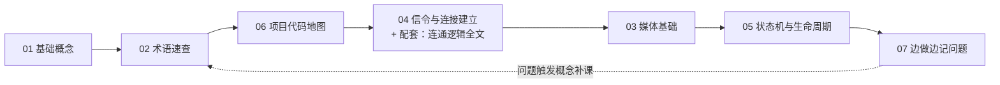

# WebRTC 伴随手册

> 在做 **Rephone Security**（相机端 App + flutter-webrtc-server 信令服务）过程中，边做边写的 WebRTC 学习笔记与踩坑记录。
> 读者定位：**WebRTC 小白**，从零开始建立心智模型，再把每个知识点对齐到本项目的真实代码。

---

## 〇、如何使用这本手册

1. **按顺序读**：从 `01` 基础概念开始 → `02` 术语（遇到不懂的词随时回来查）→ `03~05` 概念深化。
2. **对齐代码**：每章末尾都有「对应本项目」小节，指到 `rephone-security` / `flutter-webrtc-server` 的具体文件，边读边看代码最有效。
3. **记录问题**：遇到 bug / 疑问，按 `07-问题与坑位记录.md` 的模板追加一条，并在本文「完善进度表」登记。
4. **配套资料（仓库外私有，本书不含）**：`04`、`06` 章提到的 `docs/监控端WebRTC信令连通逻辑.md`（连通全链路时序）属于 Rephone Security 私有项目文档，未随本书发布；仅在你本地工作区可读。

## 一、章节总目录

```text
webrtc-handbook/                      ← 本仓库根目录（电子书站点工程）
├── README.md                 ← 仓库门面：简介 + 电子书链接 + 本地预览方法
├── docs/                     ← 电子书正文源码（Markdown，唯一真源）
│   ├── index.md              ← 首页：总目录 + 使用说明 + 完善进度表
│   ├── 01-WebRTC-基础概念.md  ← 【已填充】是什么、为什么、五大阶段、四大 API
│   ├── 02-WebRTC-术语速查表.md  ← 【基础已填充】遇到不认识的词来这查，持续追加
│   ├── 03-音视频与媒体基础.md  ← 【骨架】轨道/流/编解码/SDP/RTP
│   ├── 04-信令与连接建立.md    ← 【骨架+4.0/4.3已填充】HTTPS/WSS、TURN、ICE 候选/探测/转发
│   ├── 05-状态机与生命周期.md  ← 【骨架】各状态枚举/心跳/断线重连
│   ├── 06-项目代码地图.md      ← 【骨架】两端文件索引 / 调用链 / 关键配置
│   └── 07-问题与坑位记录.md    ← 【骨架+示例】踩坑仓库，随遇随记
├── mkdocs.yml                ← 电子书站点配置（MkDocs Material）
├── requirements.txt
└── .github/workflows/pages.yml   ← 推 main 自动构建发布到 GitHub Pages
```

## 二、推荐阅读路线（新手 3 步走）



- 第 1 步：`01` → `02` → `06`，先"知道是什么 + 代码在哪"。
- 第 2 步：`04` → `03`，搞懂"消息怎么传、媒体怎么流"。
- 第 3 步：一直做下去，`07` 是长期生长的仓库。

## 三、完善进度表（每补充一章内容就更新这里）

| 章节 | 状态 | 最近更新 | 下次要补的内容（TODO） |
| --- | --- | --- | --- |
| 01 WebRTC 基础概念 | 🟢 已填充 | 2026-09-09 | 可加常见误解问答 |
| 02 术语速查表 | 🟡 基础已填充 | 2026-09-10 | 已加「HTTPS vs WSS」；随学习追加新术语 |
| 03 音视频与媒体基础 | ⚪ 仅骨架 | 2026-09-09 | 见文内「待填充清单」 |
| 04 信令与连接建立 | 🟡 骨架 + 4.0/4.3 已填充 | 2026-09-11 | TURN(4.0.3)、ICE 全流程(4.3，含 candidate 报文格式与三跳转发) 已完成；待补 Offer-Answer(4.2)/DTLS/SRTP(4.4)/服务端剖析(4.5) |
| 05 状态机与生命周期 | ⚪ 仅骨架 | 2026-09-09 | 见文内「待填充清单」 |
| 06 项目代码地图 | 🟡 骨架+初步索引 | 2026-09-09 | 见文内「待填充清单」 |
| 07 问题与坑位记录 | 🟡 骨架+1 条示例 | 2026-09-09 | 随项目填充 |

图例：🟢 已填充 ｜ 🟡 部分填充 ｜ ⚪ 仅骨架

## 四、写作约定（让后续每个人都能接上）

1. **面向小白**：先比喻、后术语；每讲一个概念尽量给"生活化例子 → 标准定义 → 本项目代码"三段。
2. **来源可溯**：涉及本项目代码一律标注文件路径与行号（若方便），涉及规范标注 RFC。
3. **状态可视**：章节文件顶部放一行状态徽标（参考 README 图例），写完内容记得同步更新上表。
4. **宁缺毋滥**：不懂的先留占位 `TODO:`，不硬写。
5. **问题统一入库**：任何 Bug/疑问一律记到 `07`，不要散落在各处。

## 五、相关外部资料（常用）

- flutter_webrtc 官方示例：`https://github.com/flutter-webrtc/flutter-webrtc-server`（本项目服务端即源自此）
- Google WebRTC 官方文档：`https://webrtc.org/getting-started/overview`
- MDN WebRTC API：`https://developer.mozilla.org/zh-CN/docs/Web/API/WebRTC_API`
- 信令/TURN 规范背景：RFC 3264 (SDP offer/answer)、RFC 8445 (ICE)、RFC 5766 (TURN)

## 六、本地预览 / 发布说明（维护者）

本书用 [MkDocs Material](https://squidfunk.github.io/mkdocs-material/) 渲染成电子书网站。**唯一真源仍是本目录的 Markdown 文件**，`site/` 为构建产物、不入库。

```bash
# 首次：建虚拟环境并装依赖
python3 -m venv .venv
.venv/bin/pip install -r requirements.txt

# 本地预览：http://127.0.0.1:8000
.venv/bin/mkdocs serve

# 构建静态站点到 site/
.venv/bin/mkdocs build
```

推送到 GitHub `main` 分支后，`.github/workflows/pages.yml` 会自动构建并发布到 GitHub Pages。注意：章节里提到的 `rephone-security` / `flutter-webrtc-server` 属私有项目代码，仅以"代码位置提示"形式出现，方便对齐自己项目时检索。
